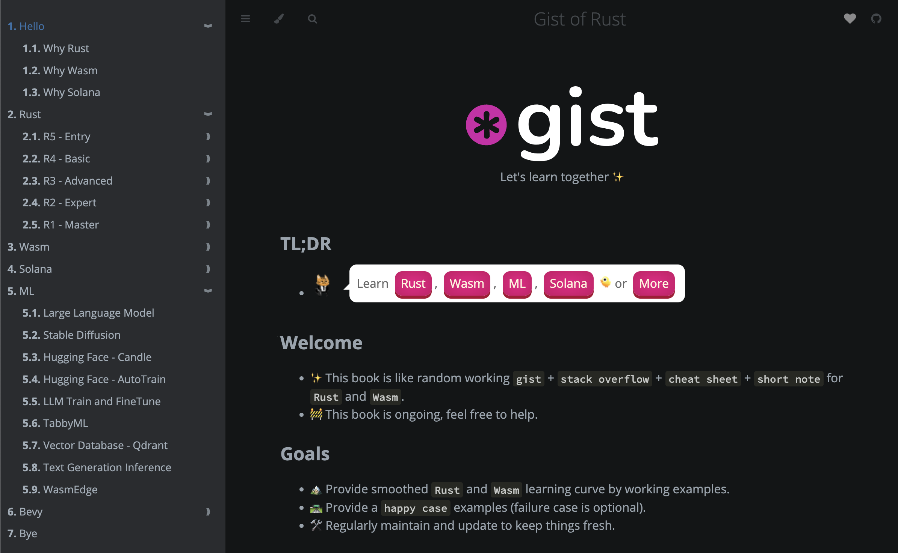

# Gist of Rust Book

Focus on gist of `Rust`, `Wasm`, `Solana`, `Generative AI`, `Bevy`.

> 🚧 This gist is work-in-progress, feel free to help out!



## Online

Go to 👉 https://book.gist.rs/

## Develop

```
cargo install mdbook
cargo install mdbook-svgbob
cargo install mdbook-mermaid

mdbook serve
```

## Notifications

Get notified when a book gets published by

- [Following katopz on Twitter](https://twitter.com/katopz) or
- [Subscribing to this repo's release RSS feed](https://github.com/gist-rs/book/releases.atom) or
- Watching this repo's releases (click `Watch` -> click `Custom` -> select `Releases` -> click `Apply`)

## Feedback

Got feedback? [Open an issue](https://github.com/gist-rs/book/issues/new) - I accept PRs for quick fixes like typos and grammar!

## Discuss

Got questions? Check out our [discussion forum](https://github.com/gist-rs/book/discussions) - jump in and start chatting!

## TODO

- [ ] `WASM`: Try `alloc` from https://hackmd.io/@alxiong/rust-no-std
