# Rapier

Refer to: https://taintedcoders.com/bevy/rapier/

## 3 Pipelines

```mermaid
graph LR
  A["Pipelines"]---B["1️⃣ physics"]
  A---C["2️⃣ collider"]
  A---D["3️⃣ query"]
```



### 1️⃣ The physics pipeline

#### Our forces are calculated by two separate solvers:


#### The overall sequence looks like this:


```rust,editable
pub fn step(
    &mut self,
    gravity: &Vector<Real>,
    integration_parameters: &IntegrationParameters,
    islands: &mut IslandManager,
    broad_phase: &mut BroadPhase,
    narrow_phase: &mut NarrowPhase,
    bodies: &mut RigidBodySet,
    colliders: &mut ColliderSet,
    impulse_joints: &mut ImpulseJointSet,
    multibody_joints: &mut MultibodyJointSet,
    ccd_solver: &mut CCDSolver,
    query_pipeline: Option<&mut QueryPipeline>,
    hooks: &dyn PhysicsHooks,
    events: &dyn EventHandler
)
```

### 2️⃣ The collider pipeline

> A lighter alternative to the physics pipeline is using only the collision pipeline.

```rust,editable
pub fn step(
    &mut self,
    prediction_distance: Real,
    broad_phase: &mut BroadPhase,
    narrow_phase: &mut NarrowPhase,
    bodies: &mut RigidBodySet,
    colliders: &mut ColliderSet,
    query_pipeline: Option<&mut QueryPipeline>,
    hooks: &dyn PhysicsHooks,
    events: &dyn EventHandler,
)
```

### 3️⃣ The query pipeline

> Queries are how we ask about our colliders. The pipeline itself can be in one of three modes:

```rust,editable
// Indicates how the colliders position should be taken into account when
// updating the query pipeline.
pub enum QueryPipelineMode {
    // The `Collider::position` is taken into account.
    CurrentPosition,
    // The `RigidBody::next_position * Collider::position_wrt_parent` is taken into account for
    // the colliders positions.
    SweepTestWithNextPosition,
    // The `RigidBody::predict_position_using_velocity_and_forces * Collider::position_wrt_parent`
    // is taken into account for the colliders position.
    SweepTestWithPredictedPosition {
        // The time used to integrate the rigid-body's velocity and acceleration.
        dt: Real,
    },
}
```

---

## Simulating physics with Bevy Rapier

---

## Rigid bodies

> 3 kinds of RigidBody

1. `RigidBody::Dynamic` // a balls
1. `RigidBody::Fixed` // a grounds
1. `RigidBody::KinematicPositionBased`/`RigidBody::KinematicVelocityBased` // a player

---

## Collisions

Attach `RigidBody` to `Collider` to the same entity to make it collide.

```rust,editable
// Create a simple solid ball
commands
    .spawn(RigidBody::Dynamic)
    .insert(Collider::ball(0.5));

// Create a hollow ball from a mesh
commands
    .spawn(RigidBody::Dynamic)
    .insert(Collider::from_bevy_mesh(
        Mesh::from(shape::UVSphere::default()),
        ComputedColliderShape::TriMesh
    );
```

Or just detect collisions (aka door sensor)

```rust,editable
commands
    .spawn(Collider::ball(0.5))
    .insert(Sensor);
```

Other components we can add to affect our colliders:

1. `LockedAxes` to prevent certain movement.
1. `Damping` to simulate air friction.
1. `Dominance` to make some objects godmode over others.
1. `Ccd` to do continuous collision detection for fast things like bullets.
1. `Sleeping` to manually wake up non moving rigid bodies.

Collision detection works in Rapier is in two phases:

1. `The broad phase`: finds anything contacting or intersecting and flags them.
1. `The narrow phase`: iterates over items found in the broad phase and calculates the collision `CollisionEvent`, `ContactForceEvent` events.

### Filtering collisions

When we want to make only some things collide with each other we can choose to set a collision group by initializing a `CollisionGroups` component with both the `membership` of our group and the `filter`:

```rust,editable
commands
    .spawn(Collider::ball(0.5))
    // First argument 👇 is the membership, second 👇 is the filter
    .insert(CollisionGroups::new(0b1101.into(), 0b0100.into()));
```

The `membership` parameter determines who you are and is how others reference you. If you say you are part of group 1 then everyone who filters for group 1 will be able to interact with you.

The `filter` parameter determines who you can interact with. If you say you can interact with members of group 1 then any entity assigned to group 1 will produce a collision if we make contact.

`0b` = binary prefix.

For example, let’s say you have four groups:

Objects that can collide with walls.
Objects that can collide with other objects of the same group.
Objects that can collide with ground.
Objects that can collide with the ceiling.

`0b1011` = collide with [`1` walls, `0` not collide, `1` ground, `1` ceiling]

If instead we wanted to produce the contact events but not apply the forces of the collision then we could do the same thing with `SolverGroups`: (aka `Sensor`)

```rust,editable
commands
    .spawn(Collider::ball(0.5))
    .insert(SolverGroups::new(0b0011.into(), 0b1011.into());
```

One gotcha is that by default your kinematic rigid bodies won’t collide with your fixed bodies. This is because they are not listening for the right contact events. To enable this behaviour we need to add a `ActiveCollisionTypes` component:

```rust,editable
commands
    .spawn(RigidBody::Fixed)
    .insert(Collider::ball(0.5))
    .insert(ActiveCollisionTypes::default() | ActiveCollisionTypes::KINEMATIC_FIXED);
```

## Events

The narrow phase will produce events like `CollisionEvent` and `ContactForceEvent` but not by default. To enable this at least one of the contacted entities needs to have a `ActiveEvents::COLLISION_EVENTS` or `ActiveEvents::CONTACT_FORCE_EVENTS` component to trigger them.

```rust,editable
/* A system that displays the events. */
fn display_events(
    mut collision_events: EventReader<CollisionEvent>,
    mut contact_force_events: EventReader<ContactForceEvent>,
) {
    for collision_event in collision_events.iter() {
        println!("Received collision event: {:?}", collision_event);
    }

    for contact_force_event in contact_force_events.iter() {
        println!("Received contact force event: {:?}", contact_force_event);
    }
}
```

## Vehicles

- Good car example but `ammo.js`: https://github.com/kripken/ammo.js/blob/main/examples/webgl_demo_vehicle/index.html
- Perfect `Rapier` example but js: https://github.com/grndctrl/vehicle-canary
- Adjustable wheel and car detail but `Bevy 0.7`: https://github.com/gavlig/gryazevichki
- Weird physics fake suspension and broken Camera `Bevy 0.10`: https://github.com/Biped-Potato/car_game
- Working but `bevy_xpbd_3d` and only box, no wheel `Bevy 0.11.3`: https://github.com/tbillington/driving-physics-repro
- Should work but [freezing](https://github.com/dimforge/rapier/issues/528): https://github.com/dimforge/rapier/blob/master/examples3d/vehicle_controller3.rs
- How to make the ghost's movement respect the surfaces of the terrain. // Work with `Bevy 0.10.0` but weird move.: https://github.com/shnewto/limbo_pass
- Nice but heavy lib rebuild, some sound bug `Bevy 0.11.3`: https://github.com/alexichepura/bevy_garage
