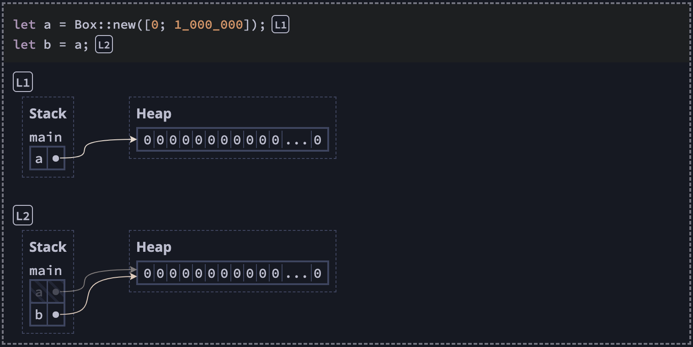

# Bye

## Rust Resources

### 📚 Reading

1. [Official Book](https://doc.rust-lang.org/book/): Don't skip this.
1. [Easy Rust](https://dhghomon.github.io/easy_rust/Chapter_1.html): Easier to read, no fancy word.
1. [The Rust Reference](https://doc.rust-lang.org/stable/reference/): Feel like short note 🤔.
1. [Asynchronous Programming in Rust](https://rust-lang.github.io/async-book/01_getting_started/01_chapter.html): Collection of `async` things.
1. [Rust Design Patterns](https://rust-unofficial.github.io/patterns/): Design Patterns obviously.
1. [The Embedded Rust Book](https://doc.rust-lang.org/stable/embedded-book/): Embedded things.
1. [MacroKata](https://tfpk.github.io/macrokata/): A set of exercises which you can use to learn how to write `macros` in `Rust`.
1. [Rust API Guidelines](https://rust-lang.github.io/api-guidelines/about.html): How to design and present APIs.
1. [The Rustonomicon](https://doc.rust-lang.org/nomicon): The Dark Arts of Unsafe `Rust`.
1. [Rust Atomics and Locks](https://marabos.nl/atomics): Low-Level Concurrency in Practice.
1. [The Rust Performance Book](https://nnethercote.github.io/perf-book/introduction.html): Contains many techniques that can improve the performance.
1. [Effective Rust](https://www.lurklurk.org/effective-rust/intro.html): 35 Specific Ways to Improve Your Rust Code.

### 👨‍🍳 Cooking

1. [Rust Cookbook](https://rust-lang-nursery.github.io/rust-cookbook/intro.html): Recommend!.
1. [A half-hour to learn Rust](https://fasterthanli.me/articles/a-half-hour-to-learn-rust): Took more than a half-hour for me 😅.
1. [Blessed](https://blessed.rs/crates#section-common-subsection-general): An unofficial guide to the Rust ecosystem.

### 👨🏻‍💻 Doing

1. [Rust By Example](https://doc.rust-lang.org/rust-by-example): Less talk, Plenty of working example.
1. [Rustlings](https://github.com/rust-lang/rustlings): Learn by fixing bugs.

### 🎮 Playing

1. [The Rust Programming Language + Quiz](https://rust-book.cs.brown.edu/): Tricky quiz, viz stack/heap.
   
1. [Rust By Practice](https://github.com/sunface/rust-by-practice): Fill in the blank quiz.
1. [Tour of Rust](https://tourofrust.com/): Explore rust with playground.

### 👍 Recommended

1. [Rust for JavaScript Developers](https://rustforjs.dev): Well taught from this to that, by [Sid Chatterjee](https://twitter.com/chatsidhartha)
1. [Programming Rust, 2nd Edition](https://www.oreilly.com/library/view/programming-rust-2nd/9781492052586/): In depth detail about heap/stack.
1. [Rust for Rustaceans](https://nostarch.com/rust-rustaceans): More explain = less code.
1. [Idiomatic Rust code](https://github.com/mre/idiomatic-rust): More to read.

---

## WASM Resources

1. [Rust and WebAssembly](https://rustwasm.github.io/docs/book/)
1. [The `wasm-bindgen` Guide](https://rustwasm.github.io/wasm-bindgen/)
1. [Hello wasm-pack!](https://rustwasm.github.io/docs/wasm-pack/)
1. [Second State](https://github.com/second-state/wasm-learning)
1. [WebAssembly threads](https://web.dev/webassembly-threads/)
1. [Rhai - WebAssembly (WASM) Build](https://rhai.rs/book/start/builds/wasm.html)
1. [Rust `no_std` Playbook](https://hackmd.io/@alxiong/rust-no-std)

## Binding Resources

1. [CXX — safe `FFI` between Rust and C++](https://github.com/dtolnay/cxx)
1. [The `UniFFI` user guide](https://mozilla.github.io/uniffi-rs/)
1. [Rust-CUDA](https://rust-gpu.github.io/Rust-CUDA/faq.html)

---

## Solana Resources

1. [Solana Cookbook](https://solanacookbook.com/)
1. [SolDev](https://soldev.app/)
1. [Anchor](https://github.com/coral-xyz/anchor/tree/master/tests)
1. [Metaplex](https://github.com/metaplex-foundation/metaplex-program-library)

---

### Awesome

1. https://github.com/katopz/awesome-rust
1. https://github.com/katopz/awesome-wasm
1. https://github.com/avareum/awesome-solana
