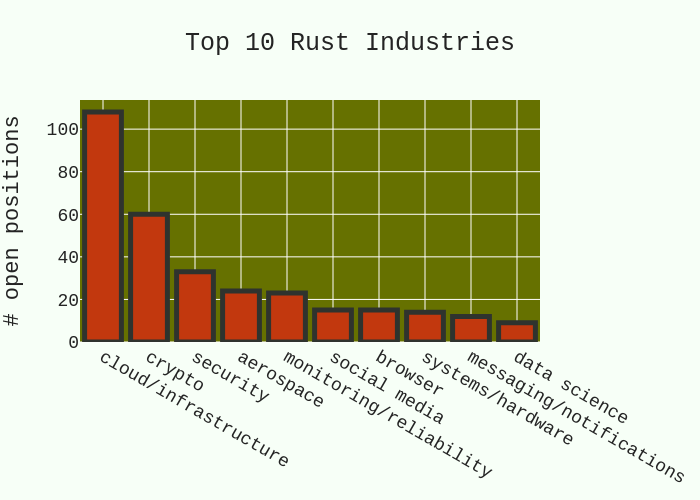

# Why Rust

 Continue reading 👇 or just <a class="button" href="../rust/mod.html">skip it. 👉</a>

## Reasons

- 1Password: [We believe there is no better language up to that challenge than `Rust` 🦀](https://foundation.rust-lang.org/news/secure-app-development-with-rust-s-memory-model/)
- Android: [For the lower layers of the OS, `Java` and `Kotlin` are not an option.](https://source.android.com/docs/setup/build/rust/building-rust-modules/overview)
- Apple: [Our codebase is written entirely in modern `Rust` 🦀.](https://jobs.apple.com/en-us/search?search=rust&sort=relevance)
- AWS: [`Rust` 🦀 is an amazing technology to sustain and secure our industry.](https://aws.amazon.com/blogs/opensource/sustainability-with-rust/)
- Azure: [It's time to use `Rust` 🦀.](https://twitter.com/markrussinovich/status/1571995117233504257)
- Cloudflare: [`Rust` 🦀 is staking its claim as a must-have in the developer toolbox.](https://blog.cloudflare.com/workers-rust-sdk/)
- Discord: [We drastically improved the performance of a service by switching its implementation from `Go` to `Rust` 🦀.](https://discord.com/blog/why-discord-is-switching-from-go-to-rust)
- Disney+: [We chose `Rust` 🦀, targeting WebAssembly (`WASM`), for ease of web deployment and app updatability.](https://medium.com/disney-streaming/introducing-the-disney-application-development-kit-adk-ad85ca139073)
- Facebook: [Reliability is a top priority. That’s why the team chose to go with `Rust` 🦀 over `C++`.](https://engineering.fb.com/2021/04/29/developer-tools/rust/)
- Fastly: [Why We Love `Rust` 🦀: Ferris Is Only Part Of It.](https://dev.to/fastly/why-we-love-rust-ferris-is-only-part-of-it-53hc)
- Google: [Should your team adopt the `Rust` 🦀 programming language?](https://www.youtube.com/watch?v=Gnp4XP1b82E)
- Google Security: [We need to be able to use `Rust` 🦀 anywhere in the codebase](https://security.googleblog.com/2022/12/memory-safe-languages-in-android-13.html)
- Huawei: [Huawei is committed to the the success of `Rust` 🦀.](https://trusted-programming.github.io/2021/02/07/our-rust-mission-at-huawei.html)
- Hugging face: [zero-copy is achievable in `Rust` 🦀](https://github.com/huggingface/safetensors#notes)
- IBM: [Why you should learn the `Rust` 🦀 programming language](https://developer.ibm.com/articles/os-developers-know-rust/)
- InfluxData: [`Rust` 🦀 has fearless concurrency which allows developers to write code free of subtle bugs.](https://www.influxdata.com/blog/meet-founders-who-rewrote-in-rust/)
- Intel: [`Rust` 🦀 is the future of systems programming, `C` is the new Assembly](https://youtu.be/l9hM0h6IQDo)
- LogRocket: [Optimized `Rust` 🦀 code was at least 30 percent faster than the most optimized Go code.](https://blog.logrocket.com/when-to-use-rust-when-to-use-golang/)
- Microsoft: [Ask the Expert: `Rust` 🦀 at Microsoft.](https://www.youtube.com/watch?v=1uAsA1hm52I)
- MIT: [How `Rust` 🦀 went from a side project to the world’s most-loved programming language.](https://www.technologyreview.com/2023/02/14/1067869/rust-worlds-fastest-growing-programming-language/)
- NGINX: [Respect to memory safety and correctness. This has paved the way for languages like `Rust` 🦀](https://www.nginx.com/blog/extending-nginx-with-rust-an-alternative-to-c/)
- PostgresML: [We are huge fans of `Rust` 🦀 (almost our entire codebase is written in it)](https://postgresml.org/blog/how-we-generate-javascript-and-python-sdks-from-our-canonical-rust-sdk)
- Twitter: [Navi:ML serving server implemented in `Rust` 🦀 offering top-notch performance.](https://github.com/twitter/the-algorithm/tree/main/navi)
- Ubuntu: [Clearly, `Rust` 🦀 has excellent foundations for making reliable and efficient software](https://ubuntu.com/blog/why-and-how-to-use-rust-on-ubuntu)
- Vercel: [`Rust` 🦀 was a clear choice from day one.](https://vercel.com/blog/turborepo-migration-go-rust)
- Volvo: [Code developed from scratch should definitely be developed in `Rust` 🦀.](https://medium.com/volvo-cars-engineering/why-volvo-thinks-you-should-have-rust-in-your-car-4320bd639e09)
- X: [`Rust` 🦀 has proven to be an ideal choice for building scalable, reliable, and maintainable infrastructure. ](https://x.ai/)

## Jobs

> Refer to: [Rust Jobs Report: August 2023](https://filtra.io/rust-aug-23)

## Resources

- [awesome-rust](https://github.com/katopz/awesome-rust)

---

[Learn Rust ➠](../rust/mod.md)
