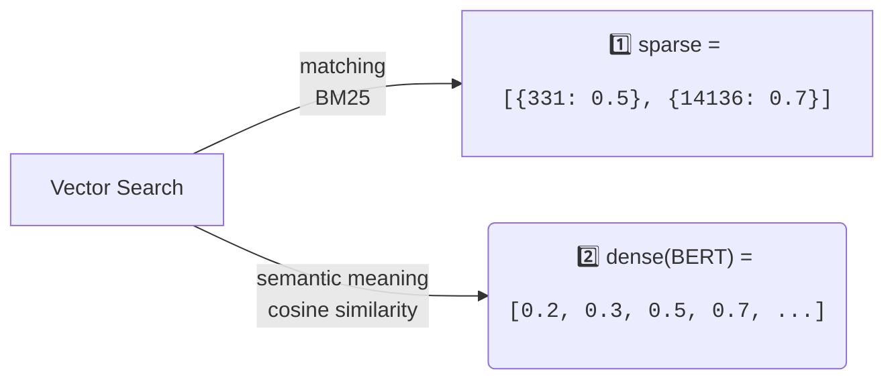

# Embeddings

## Raw

- [Sparse Vectors in Qdrant: Pure Vector-based Hybrid Search](https://qdrant.tech/articles/sparse-vectors/)
- [SPLADE for Sparse Vector Search Explained](https://www.pinecone.io/learn/splade/)
- [Hybrid Search: SPLADE (Sparse Encoder)](https://medium.com/@sowmiyajaganathan/hybrid-search-splade-sparse-encoder-neural-retrieval-models-d092e5f46913)



## Build

```bash
docker build . --platform linux/amd64 -t huggingface/tei
```

# Mac Silicon, from local

```bash
# Setup
cargo install --path router -F candle -F metal

# Run
model=intfloat/multilingual-e5-large
revision=main
volume=$PWD/data

text-embeddings-router --model-id $model --revision $revision --port 8081

# Embed
curl 127.0.0.1:8081/embed \
    -X POST \
    -d '{"inputs":"What is Deep Learning?"}' \
    -H 'Content-Type: application/json'

# Classifier model
model=BAAI/bge-large-en-v1.5
revision=refs/pr/5

# Rerank
curl 127.0.0.1:8081/rerank \
    -X POST \
    -d '{"query":"What is Deep Learning?", "texts": ["Deep Learning is not...", "Deep learning is..."]}' \
    -H 'Content-Type: application/json'

# Predict
curl 127.0.0.1:8081/predict \
    -X POST \
    -d '{"inputs":"I like you."}' \
    -H 'Content-Type: application/json'
```
