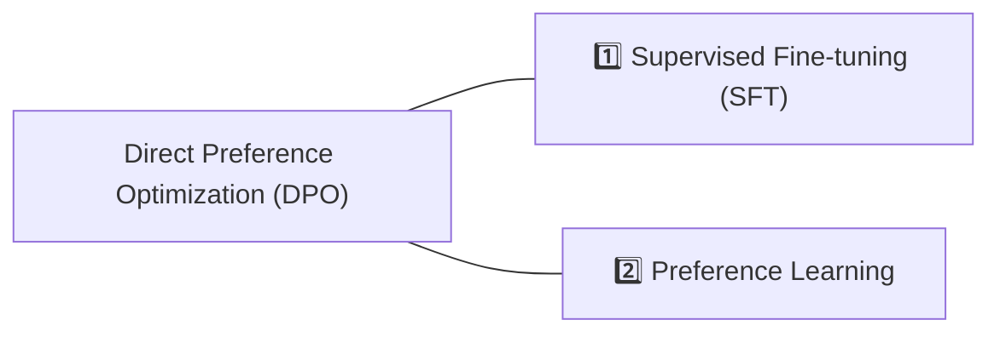

# LLM FineTuning

## Options

- [RLHF in 2024 with DPO & Hugging Face](https://www.philschmid.de/dpo-align-llms-in-2024-with-trl)
- [Fine-tuning SeaLLM on Your Own Dataset with QLoRA on RTX4090](./finetune-seallm.ipynb)
- [MLX: Quantize, LoRA, QLoRA, Fuse](./mlx.md)

## Pipelines

> Ref: https://ai.plainenglish.io/direct-preference-optimization-dpo-a-simplified-approach-to-fine-tuning-large-language-models-bae1c6d7ec29



## Brain dump (WIP)

### A Beginner’s Guide to Fine-Tuning Mistral 7B Instruct Model

> Fixed notebook is [Mistral_7B_qLora_Finetuning.ipynb](./Mistral_7B_qLora_Finetuning.ipynb). But prompt formatting is still in doubt.

- Colab: https://adithyask.medium.com/a-beginners-guide-to-fine-tuning-mistral-7b-instruct-model-0f39647b20fe
- Source: https://github.com/adithya-s-k/CompanionLLM
- ⚠️ This notebook needs to add `pad_token_id=2` when calling merged_model.generate() in Test the merged model:

  ```python
  outputs = merged_model.generate(input_ids=input_ids, pad_token_id=2,
  max_new_tokens=100, do_sample=True, top_p=0.9,temperature=0.5)
  ```
