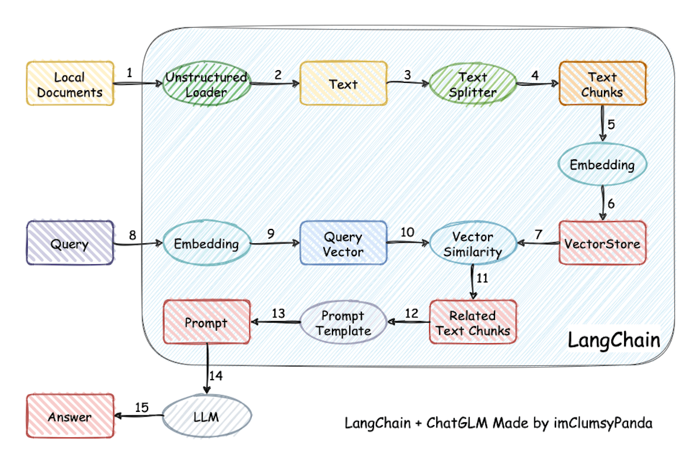
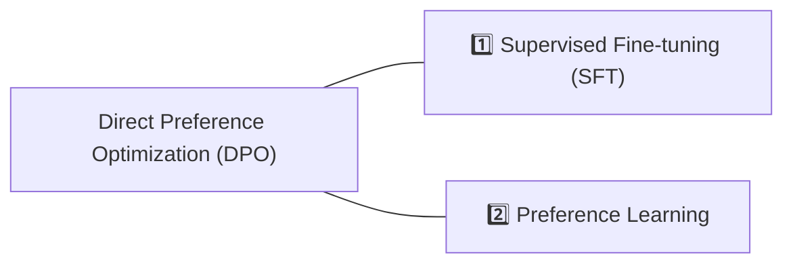

# LLM Train and FineTune

## Overview



> ref: https://github.com/chatchat-space/Langchain-Chatchat/blob/master/README_en.md

## Pipelines

> Ref: https://ai.plainenglish.io/direct-preference-optimization-dpo-a-simplified-approach-to-fine-tuning-large-language-models-bae1c6d7ec29



## Brain dump (WIP)

### A Beginner’s Guide to Fine-Tuning Mistral 7B Instruct Model

> Fixed notebook is [Mistral_7B_qLora_Finetuning.ipynb](./Mistral_7B_qLora_Finetuning.ipynb). But prompt formatting is still in doubt.

- Colab: https://adithyask.medium.com/a-beginners-guide-to-fine-tuning-mistral-7b-instruct-model-0f39647b20fe
- Source: https://github.com/adithya-s-k/CompanionLLM
- ⚠️ This notebook needs to add `pad_token_id=2` when calling merged_model.generate() in Test the merged model:

  ```python
  outputs = merged_model.generate(input_ids=input_ids, pad_token_id=2,
  max_new_tokens=100, do_sample=True, top_p=0.9,temperature=0.5)
  ```

## TODO

- [ ] Try The Alignment Handbook: https://github.com/huggingface/alignment-handbook
- [ ] [Using MistralLite with HuggingFace Transformers and FlashAttention-2](https://github.com/awslabs/extending-the-context-length-of-open-source-llms/blob/main/MistralLite/huggingface-transformers/example_usage.ipynb)
- [ ] https://github.com/aigeek0x0/zephyr-7b-alpha-langchain-chatbot
- [ ] https://github.com/chatchat-space/Langchain-Chatchat
- [ ] https://github.com/flows-network/demo-RAG-embeddings

## TOREAD

- [ ] Optimizing Text Embeddings with HuggingFace’s text-embeddings-inference Server and `LlamaIndex`: https://levelup.gitconnected.com/optimizing-text-embeddings-with-huggingfaces-text-embeddings-inference-server-and-llamaindex-ef7df35882a4
- [ ] Demystifying Advanced `RAG` Pipelines: https://github.com/pchunduri6/rag-demystified
- [ ] Jina 8K Context Window `Embeddings`: https://github.com/run-llama/llama_index/blob/main/docs/examples/embeddings/jina_embeddings.ipynb
- [ ] Read, try and summary: https://github.com/replit/replitLM#alpaca-style-instruct-tuning-with-hugging-face-transformers
- [ ] Try fine-tune-mistral: https://github.com/abacaj/fine-tune-mistral
- [ ] Try fine-tune-mistral: https://github.com/brevdev/notebooks/blob/main/mistral-finetune-own-data.ipynb
- [ ] Try `LocalGPT`: https://github.com/PromtEngineer/localGPT
- [ ] Read and summary: https://twitter.com/manelferreira_/status/1711788177458090388
- [ ] `LLaVA`: Visual and language AI with GPT-4, instruction tuning to visual data.
