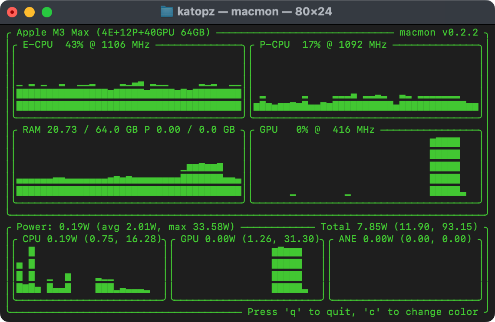

# Apple - MLX

- https://github.com/ml-explore
- https://github.com/ml-explore/mlx-examples

## Setup

```bash
python3 -m venv .venv
source .venv/bin/activate
python3 -m pip install -U mlx-lm
python3 -c "import mlx_lm; print(mlx_lm.__version__)"
```

## Infer (huggingface)

```bash
# MODEL=SeaLLMs/SeaLLM-7B-v2.5-GGUF
# MODEL=01-ai/Yi-1.5-9B-Chat
# MODEL=mistralai/Mistral-7B-v0.3
# MODEL=Qwen/Qwen2-7B-Instruct-MLX
MODEL=google/gemma-2-9b-it
python -m mlx_lm.generate --model ${MODEL} --max-tokens 512 --prompt "Write helloworld code in Rust"
```


## Monitor (Optional)

```
brew install vladkens/tap/macmon
macmon
```



## Infer (mlx-community)

```bash
# MODEL=mlx-community/Llama-3-8B-Instruct-Gradient-1048k-8bit
# MODEL=mlx-community/Mistral-7B-v0.3-4bit
# MODEL=mlx-community/Mistral-7B-Instruct-v0.3-4bit
# MODEL=mlx-community/gemma-2-27b-it-4bit
# MODEL=mlx-community/DeepSeek-Coder-V2-Lite-Instruct-4bit-mlx
MODEL=mlx-community/Meta-Llama-3.1-8B-Instruct-8bit
python3 -m mlx_lm.generate --model ${MODEL} --prompt "Write helloworld code in Rust"
```

## Infer (OpenThaiGPT)

```bash
MODEL=mlx-community/openthaigpt-1.0.0-7b-chat-4bit-mlx

python3 -m mlx_lm.generate --model ${MODEL} --prompt "[INST] <<SYS>
You are a question answering assistant. Answer the question as truthful and helpful as possible คุณคือผู้ช่วยตอบคำถาม จงตอบคำถามอย่างถูกต้องและมีประโยชน์ที่สุด
<</SYS>>
แนะนำอาหารไทย 3 อย่าง [/INST]"
```

## Infer with `im_start`

```bash
python3 -m mlx_lm.generate --model mlx-community/NeuralBeagle14-7B --prompt "<|im_start|>system\nYou are the best programmer<|im_end|>\n<|im_start|>user\nWrite helloworld code in Rust.<|im_end|>\n<|im_start|>assistant\n" --max-tokens 2048
```

## Infer (manual, outdated not recommend)

```bash
# Setup
python3 -m venv .venv
source .venv/bin/activate
pip install -r requirements.txt

# Download model (outdate, not recommend)
curl -LO https://files.mistral-7b-v0-1.mistral.ai/mistral-7B-v0.1.tar
tar -xf mistral-7B-v0.1.tar

# Convert to 4bits quantize
python convert.py \
    --torch-path mistral-7B-v0.1 -q

# Or just Download npz model
curl -LO https://huggingface.co/mlx-community/Mistral-7B-Instruct-v0.2/resolve/main/config.json
curl -LO https://huggingface.co/mlx-community/Mistral-7B-Instruct-v0.2/resolve/main/tokenizer.model
curl -LO https://huggingface.co/mlx-community/Mistral-7B-Instruct-v0.2/resolve/main/weights.npz

# Infer
python mistral.py --prompt "Write helloworld code in Rust"
```

## LoRA example

> https://github.com/ml-explore/mlx-examples/tree/main/lora

```bash
# Setup
python3 -m venv .venv
source .venv/bin/activate
pip install -r requirements.txt

# Download model
curl -O https://files.mistral-7b-v0-1.mistral.ai/mistral-7B-v0.1.tar
tar -xf mistral-7B-v0.1.tar

# Convert
python convert.py \
    --torch-model mistral-7B-v0.1 \
    --mlx-model mlx_mistral_7b.npz

# Fine-tune for ./adapters.npz
python lora.py --model mlx_mistral_7b \
               --train \
               --iters 600

# Eval with ./adapters.npz
python lora.py --model mlx_mistral_7b \
               --adapter-file ./adapters.npz \
               --test
# Generate
python lora.py --model mlx_mistral_7b \
               --adapter-file ./adapters.npz \
               --num-tokens 50 \
               --prompt "table: 1-10015132-16
columns: Player, No., Nationality, Position, Years in Toronto, School/Club Team
Q: What is terrence ross' nationality
A: "

# Fine-tune from custom data jsonl
# --batch-size 4, 2, 1
# --lora-layers 16, 8, 4
python lora.py \
   --model mlx_mistral_7b \
   --train \
   --batch-size 2 \
   --lora-layers 16

# Test jsonl
python lora.py --model mlx_mistral_7b \
               --adapter-file ./adapters.npz \
               --num-tokens 50 \
               --prompt "table: 1-10015132-11
columns: Player, No., Nationality, Position, Years in Toronto, School/Club Team
Q: What position does the player who played for butler cc (ks) play?
A: "
```

## Quantize 4bit and Upload

```bash
# Get access token
open https://huggingface.co/settings/tokens

# Install huggingface cli
pip install --upgrade huggingface_hub
huggingface-cli login

# Pick model
MODEL=deepseek-ai/DeepSeek-R1-Distill-Qwen-7B

# Define the name
MODEL_NAME=DeepSeek-R1-Distill-Qwen-7B

# Clear old stuff
rm -rf mlx_model

# Convert and upload
python3 -m mlx_lm.convert --hf-path ${MODEL} -q --upload-repo mlx-community/${MODEL_NAME}-4bit-mlx

# Try uploaded model
python -m mlx_lm.generate --model ${MODEL} --max-tokens 512 --prompt "Translate to English: おはようご ざいます"
```

## mlx-server (Not production grade)

Run

```bash
MODEL=mlx-community/Mistral-7B-Instruct-v0.3-4bit
mlx_lm.server --model ${MODEL}
```

Test

```bash
curl localhost:8080/v1/chat/completions \
  -H "Content-Type: application/json" \
  -d '{
     "messages": [{"role": "user", "content": "Translate to English: おはようございます"}],
     "temperature": 0.0
   }'
```
