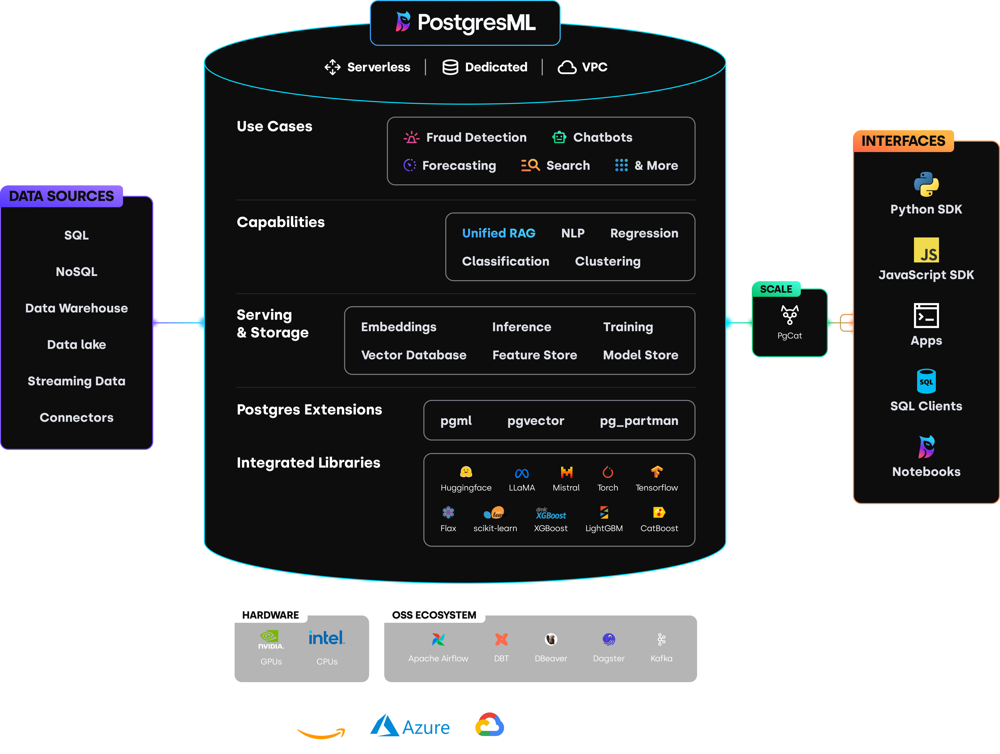

# PostgresML

Unified RAG (and else) with PostgreSQL

> Refer to: https://postgresml.org/docs/guides/unified-rag



<div style="text-align:center;width:100%;font-size:x-small;opacity:50%">Ref: https://postgresml.org/docs/</div>

## Setup (local)

> ⚠️ Must set Docker `Virtual disk limit > 128GB` and `defaultKeepStorage > 50GB`

```json
{
  "builder": {
    "gc": {
      "defaultKeepStorage": "50GB",
      "enabled": true
    }
  },
  "experimental": false
}
```

```
docker run \
    -it \
    -v postgresml_data:/var/lib/postgresql \
    -p 5433:5432 \
    -p 8000:8000 \
    ghcr.io/postgresml/postgresml:2.9.1 \
    sudo -u postgresml psql -d postgresml
```

#### With gpu

```
docker run \
    -it \
    -v postgresml_data:/var/lib/postgresql \
    --gpus all \
    -p 5433:5432 \
    -p 8000:8000 \
    ghcr.io/postgresml/postgresml:2.9.1 \
    sudo -u postgresml psql -d postgresml
```

## Use

### Check version

```
CREATE EXTENSION IF NOT EXISTS vector;
CREATE EXTENSION IF NOT EXISTS pgml;
SELECT pgml.version();
```

```
NOTICE:  extension "pgml" already exists, skipping
CREATE EXTENSION
                     version
--------------------------------------------------
 2.9.1 (a8d8218f698f3149e5cd1878731d43bdfcb0be5b)
(1 row)
```

### Use from other terminal (Optional)

```
# Install postgresql for macos
brew install postgresql

# Local
psql -h 127.0.0.1 -p 5433 -U postgresml

# Or across network
psql -h 192.168.1.33 -p 5433 -U postgresml

```

### Embeddings

```
SELECT pgml.embed(
    'BAAI/bge-m3',
    'passage: PostgresML is so easy!'
);
```

### Infer

It's crash while infer for `RTX4090` 🤷‍♂️
