# Large Language Model

We will look `llm` from `Rust` perspective.

> ref: https://twitter.com/_aigeek/status/1717046220714308026/photo/1

## Models

- Winner: [Mistral-7B](https://huggingface.co/mistralai).
- Runner up model: [Zephyr 7B Alpha](https://huggingface.co/HuggingFaceH4/zephyr-7b-alpha)
- Long context: [MistralLite](https://huggingface.co/amazon/MistralLite)
- With function call: [Openhermes 2.5 Mistral 7B](https://github.com/abacaj/openhermes-function-calling/blob/main/openhermes-functions.ipynb)

## Embedding

- Sentence Embedding [Jina AI](https://huggingface.co/jinaai): [jina-embeddings-v2-base-en](https://huggingface.co/jinaai/jina-embeddings-v2-base-en).
- [Text Embeddings Inference](https://github.com/huggingface/text-embeddings-inference)

## Rust

- [Candle](https://github.com/huggingface/candle)

## Coding

- For coding related see: [Replit Code V-1.5 3B](https://huggingface.co/replit)
- Runner up: [Tabby](https://tabby.tabbyml.com/)
- Runner up: [CodeGPT](https://www.codegpt.co/)

## RAG

- Famous: [Langchain](https://www.langchain.com/)
- Runner up: [LlamaIndex](https://www.llamaindex.ai/)

## Lazy

- [ollama](https://ollama.ai/)

## Serve

- https://github.com/huggingface/llm-ls

## Model format

- Famous but...: `GGML`
- Runner up `GGUF`.
  | Feature | `GGUF` | `GGML` |
  | -------------------------- | ------------------------------------------------- | ------------------------------------ |
  | Extensibility | Yes | No |
  | Future-proofing | Yes | No |
  | Performance | Better, especially for models with special tokens | Good |
  | Support for various models | Yes | Yes, but limited to llama.cpp models |
  | Status | Current standard format | Deprecated |

---

## Overview

```mermaid
graph LR;
A("🐍 llama") --"4-bit"--> B("🐇 llama.cpp")
B --port ggml--> C("🦀 llm")
A --"16,32-bit"--> CC("🦀 RLLaMA")
A --Apple Silicon GPU--> AA("🐍 LLaMA_MPS")
C --"napi-rs"--> I("🐥 llama-node")
E --"fine-tuning to obey ix"--> D("🐇 alpaca.cpp")
E --instruction-following--> H("🐍 codealpaca")
A --instruction-following--> E("🐍 alpaca") --LoRa--> F("🐍 alpaca-lora")
B --BLOOM-like--> BB("🐇 bloomz.cpp")
BB --LoRA--> DDDD("🐍 BLOOM-LoRA")
D --"fine-tunes the GPT-J 6B"--> DD("🐍 Dolly")
D --"instruction-tuned Flan-T5"--> DDD("🐍 Flan-Alpaca")
D --Alpaca_data_cleaned.json--> DDDD
E --RNN--> EE("🐍 RWKV-LM")
EE("🐍 RWKV-LM") --port--> EEE("🦀 smolrsrwkv")
H --finetuned--> EE
EE --ggml--> EEEE("🐇 rwkv.cpp")
A --"GPT-3.5-Turbo/7B"--> FF("🐍 gpt4all-lora")
A --ShareGPT/13B--> AAAAA("🐍 vicuna")
A --Dialogue fine-tuned--> AAAAAA("🐍 Koala")
A --meta--> AAAAAAA("🐍 llama-2")
```

- [🐍 llama](https://github.com/facebookresearch/llama): Open and Efficient Foundation Language Models.
- [🐍 LLaMA_MPS](https://github.com/jankais3r/LLaMA_MPS): Run LLaMA (and Stanford-Alpaca) inference on Apple Silicon GPUs.
- [🐇 llama.cpp](https://github.com/ggerganov/llama.cpp): Inference of LLaMA model in pure C/C++.
- [🐇 alpaca.cpp](https://github.com/antimatter15/alpaca.cpp): This combines the LLaMA foundation model with an open reproduction of Stanford Alpaca a fine-tuning of the base model to obey instructions (akin to the RLHF used to train ChatGPT) and a set of modifications to llama.cpp to add a chat interface.
- [🦀 llm](https://github.com/rustformers/llm): Do the LLaMA thing, but now in Rust 🦀🚀🦙
- [🐍 alpaca](https://github.com/tatsu-lab/stanford_alpaca): Stanford Alpaca: An Instruction-following LLaMA Model
- [🐍 codealpaca](https://github.com/sahil280114/codealpaca): An Instruction-following LLaMA Model trained on code generation instructions.
- [🐍 alpaca-lora](https://github.com/tloen/alpaca-lora): Low-Rank LLaMA Instruct-Tuning `// train 1hr/RTX 4090`
- [🐥 llama-node](https://github.com/hlhr202/llama-node): nodejs client library for llama LLM built on top of on top of llama-rs, llama.cpp and rwkv.cpp. It uses napi-rs as nodejs and native communications.
- [🦀 RLLaMA](https://github.com/Noeda/rllama): Rust+OpenCL+AVX2 implementation of LLaMA inference code.
- [🐍 Dolly](https://github.com/databrickslabs/dolly): This fine-tunes the GPT-J 6B model on the Alpaca dataset using a Databricks notebook.
- [🐍 Flan-Alpaca](https://github.com/declare-lab/flan-alpaca): Instruction Tuning from Humans and Machines.
- [🐇 bloomz.cpp](https://github.com/NouamaneTazi/bloomz.cpp): Inference of HuggingFace's BLOOM-like models in pure C/C++ built on top of the amazing llama.cpp.
- [🐍 BLOOM-LoRA](https://github.com/linhduongtuan/BLOOM-LORA): Low-Rank LLaMA Instruct-Tuning.
- [🐍 RWKV-LM](https://github.com/BlinkDL/RWKV-LM): RWKV is an RNN with transformer-level LLM performance. It can be directly trained like a GPT (parallelizable). So it's combining the best of RNN and transformer - great performance, fast inference, saves VRAM, fast training, "infinite" ctx_len, and free sentence embedding.
- [🦀 smolrsrwkv](https://github.com/KerfuffleV2/smolrsrwkv): A very basic example of the RWKV approach to language models written in Rust by someone that knows basically nothing about math or neural networks.
- [🐍 gpt4all-lora](https://github.com/nomic-ai/gpt4all): A chatbot trained on a massive collection of clean assistant data including code, stories and dialogue.
- [🐇 rwkv.cpp](https://github.com/saharNooby/rwkv.cpp): a port of BlinkDL/RWKV-LM to ggerganov/ggml. The end goal is to allow 4-bit quanized inference on CPU. `// WIP`
- [🐍 vicuna](https://vicuna.lmsys.org/): An Open-Source Chatbot Impressing GPT-4 with 90% ChatGPT Quality.

## Tools

```mermaid
graph TD;
AAAA("ChatGPT")
AAAA --> AAA
AAAA ---> J("🦀 llm-chain")
AAAA --> I
AAA --> A
A("🐍 langchain")
A --port--> AA("🐥 langchainjs")
AA --> B("🐥 langchain-alpaca")
D("🐇 alpaca.cpp") --> B
E-..-D
E-..-DD("🐍 petals")
E("🐇 llama.cpp") --ggml/13B--> H
F("🐇 whisper.cpp") --whisper-small--> H
H("🐇 talk")
I("🐍 chatgpt-retrieval-plugin") --> II("🐍 llama-retrieval-plugin")

```

- [🐍 langchain](https://github.com/hwchase17/langchain): Building applications with LLMs through composability.
- [🐥 langchainjs](https://github.com/hwchase17/langchainjs): langchain in js.
- [🐥 langchain-alpaca](https://github.com/linonetwo/langchain-alpaca): Run alpaca LLM fully locally in langchain.
- [🐇 whisper.cpp](https://github.com/ggerganov/whisper.cpp): High-performance inference of OpenAI's Whisper automatic speech recognition (ASR) model.
- [🐍 whisper-small](https://github.com/openai/whisper): Whisper is a pre-trained model for automatic speech recognition (ASR) and speech translation. Trained on 680k hours of labelled data, Whisper models demonstrate a strong ability to generalise to many datasets and domains without the need for fine-tuning.
- [🐇 talk](https://github.com/ggerganov/whisper.cpp/tree/master/examples/talk): Talk with an Artificial Intelligence in your terminal.
- [🐍 chatgpt-retrieval-plugin](https://github.com/openai/chatgpt-retrieval-plugin): The ChatGPT Retrieval Plugin lets you easily search and find personal or work documents by asking questions in everyday language.
- [🐍 llama-retrieval-plugin](https://github.com/lastmile-ai/llama-retrieval-plugin): LLaMa retrieval plugin script using OpenAI's retrieval plugin
- [🦀 llm-chain](https://github.com/sobelio/llm-chain): prompt templates and chaining together prompts in multi-step chains, summarizing lengthy texts or performing advanced data processing tasks.
- [🐍 petals](https://github.com/bigscience-workshop/petals): Run 100B+ language models at home, BitTorrent-style.
  Fine-tuning and inference up to 10x faster than offloading.

## ETC

> Refer to: https://replicate.com/blog/llama-roundup

- [Running LLaMA on a Raspberry Pi](https://twitter.com/miolini/status/1634982361757790209) by Artem Andreenko.
- [Running LLaMA on a Pixel 5](https://twitter.com/ggerganov/status/1635605532726681600) by Georgi Gerganov.
- [Run LLaMA and Alpaca with a one-liner](https://cocktailpeanut.github.io/dalai) – `npx dalai llama`
- [Train and run Stanford Alpaca on your own machine](https://replicate.com/blog/replicate-alpaca) from replicate.
- [Fine-tune LLaMA to speak like Homer Simpson](https://replicate.com/blog/fine-tune-llama-to-speak-like-homer-simpson) from replicate.
- [Llamero](https://github.com/mpociot/llamero/) – A GUI application to easily try out Facebook's LLaMA models by Marcel Pociot.
