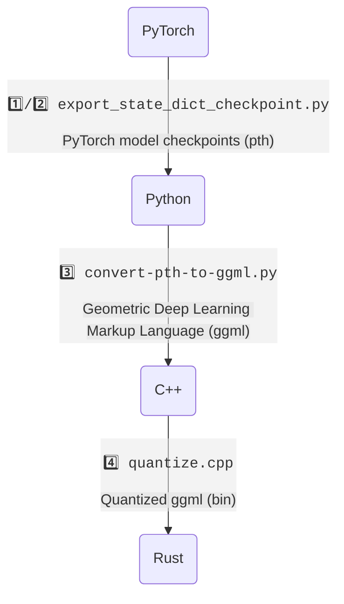

# LLaMA-rs

**LLaMA-rs** is a Rust port of the
[llama.cpp](https://github.com/ggerganov/llama.cpp) project. This allows running
inference for Facebook's [LLaMA](https://github.com/facebookresearch/llama)
model on a CPU with good performance using full precision, f16 or 4-bit
quantized versions of the model.

Just like its C++ counterpart, it is powered by the
[`ggml`](https://github.com/ggerganov/ggml) tensor library, achieving the same performance as the original code.

## Source

- https://github.com/setzer22/llama-rs

## Conversions

> Subject to change.

1️⃣ [tloen/alpaca-lora/export_state_dict_checkpoint.py](https://github.com/tloen/alpaca-lora/blob/main/export_state_dict_checkpoint.py) (llama-7b-hf)  
2️⃣ [jankais3r/LLaMA_MPS/export_state_dict_checkpoint.py](https://github.com/jankais3r/LLaMA_MPS/blob/main/export_state_dict_checkpoint.py) (llama-13b-hf)  
3️⃣ [llama.cpp/convert-pth-to-ggml.py](https://github.com/ggerganov/llama.cpp/blob/master/convert-pth-to-ggml.py)  
4️⃣ [llama.cpp/quantize.cpp](https://github.com/ggerganov/llama.cpp/blob/master/quantize.cpp)
