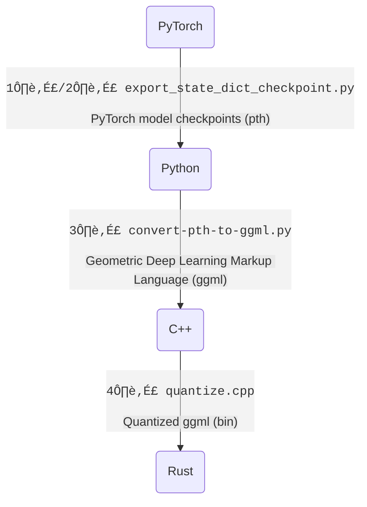

# LLaMA-rs

**LLaMA-rs** is a Rust port of the
[llama.cpp](https://github.com/ggerganov/llama.cpp) project. This allows running
inference for Facebook's [LLaMA](https://github.com/facebookresearch/llama)
model on a CPU with good performance using full precision, f16 or 4-bit
quantized versions of the model.

Just like its C++ counterpart, it is powered by the
[`ggml`](https://github.com/ggerganov/ggml) tensor library, achieving the same performance as the original code.

## Source

- https://github.com/setzer22/llama-rs

Conversions note

1️⃣ [tloen/alpaca-lora/export_state_dict_checkpoint.py](https://github.com/tloen/alpaca-lora/blob/main/export_state_dict_checkpoint.py) (llama-7b-hf)  
2️⃣ [jankais3r/LLaMA_MPS/export_state_dict_checkpoint.py](https://github.com/jankais3r/LLaMA_MPS/blob/main/export_state_dict_checkpoint.py) (llama-13b-hf)  
3️⃣ [llama.cpp/convert-pth-to-ggml.py](https://github.com/ggerganov/llama.cpp/blob/master/convert-pth-to-ggml.py)  
4️⃣ [llama.cpp/quantize.cpp](https://github.com/ggerganov/llama.cpp/blob/master/quantize.cpp)

---

## Overview

```mermaid
graph LR;
A("🐍 llama") --"4-bit"--> B("🐇 llama.cpp")
B --port ggml--> C("🦀 llama-rs")
A --"16,32-bit"--> CC("🦀 RLLaMA")
A --Apple Silicon GPU--> AA("🐍 LLaMA_MPS")
C --"napi-rs"--> I("🐥 llama-node")
E --"fine-tuning to obey ix"--> D("🐇 alpaca.cpp")
E --instruction-following--> H("🐍 codealpaca")
A --instruction-following--> E("🐍 alpaca") --LoRa--> F("🐍 alpaca-lora")
B --BLOOM-like--> BB("🐇 bloomz.cpp")
BB --LoRA--> DDDD("🐍 BLOOM-LoRA")
D --"fine-tunes the GPT-J 6B"--> DD("🐍 Dolly")
D --"instruction-tuned Flan-T5"--> DDD("🐍 Flan-Alpaca")
D --Alpaca_data_cleaned.json--> DDDD
E --RNN--> EE("🐍 RWKV-LM")
EE("🐍 RWKV-LM") --port--> EEE("🦀 smolrsrwkv")
H --finetuned--> EE
EE --ggml--> EEEE("🐇 rwkv.cpp")
A --"GPT-3.5-Turbo/7B"--> FF("🐍 gpt4all-lora")
A --"Apache0/nanoGPT"--> AAAA("🐍 Lit-LLaMA")
A --> AAA("🐍 LLaMA-Adapter")
A --ShareGPT/13B--> AAAAA("🐍 vicuna")
A --Dialogue fine-tuned--> AAAAAA("🐍 Koala")
```

- [🐍 llama](https://github.com/facebookresearch/llama): Open and Efficient Foundation Language Models.
- [🐍 LLaMA_MPS](https://github.com/jankais3r/LLaMA_MPS): Run LLaMA (and Stanford-Alpaca) inference on Apple Silicon GPUs.
- [🐇 llama.cpp](https://github.com/ggerganov/llama.cpp): Inference of LLaMA model in pure C/C++.
- [🐇 alpaca.cpp](https://github.com/antimatter15/alpaca.cpp): This combines the LLaMA foundation model with an open reproduction of Stanford Alpaca a fine-tuning of the base model to obey instructions (akin to the RLHF used to train ChatGPT) and a set of modifications to llama.cpp to add a chat interface.
- [🦀 llama-rs](https://github.com/setzer22/llama-rs): Do the LLaMA thing, but now in Rust 🦀🚀🦙
- [🐍 alpaca](https://github.com/tatsu-lab/stanford_alpaca): Stanford Alpaca: An Instruction-following LLaMA Model
- [🐍 codealpaca](https://github.com/sahil280114/codealpaca): An Instruction-following LLaMA Model trained on code generation instructions.
- [🐍 alpaca-lora](https://github.com/tloen/alpaca-lora): Low-Rank LLaMA Instruct-Tuning `// train 1hr/RTX 4090`
- [🐥 llama-node](https://github.com/hlhr202/llama-node): nodejs client library for llama LLM built on top of llama-rs. It uses napi-rs as nodejs and native communications.
- [🦀 RLLaMA](https://github.com/Noeda/rllama): Rust+OpenCL+AVX2 implementation of LLaMA inference code.
- [🐍 Dolly](https://github.com/databrickslabs/dolly): This fine-tunes the GPT-J 6B model on the Alpaca dataset using a Databricks notebook.
- [🐍 Flan-Alpaca](https://github.com/declare-lab/flan-alpaca): Instruction Tuning from Humans and Machines.
- [🐇 bloomz.cpp](https://github.com/NouamaneTazi/bloomz.cpp): Inference of HuggingFace's BLOOM-like models in pure C/C++ built on top of the amazing llama.cpp.
- [🐍 BLOOM-LoRA](https://github.com/linhduongtuan/BLOOM-LORA): Low-Rank LLaMA Instruct-Tuning.
- [🐍 RWKV-LM](https://github.com/BlinkDL/RWKV-LM): RWKV is an RNN with transformer-level LLM performance. It can be directly trained like a GPT (parallelizable). So it's combining the best of RNN and transformer - great performance, fast inference, saves VRAM, fast training, "infinite" ctx_len, and free sentence embedding.
- [🦀 smolrsrwkv](https://github.com/KerfuffleV2/smolrsrwkv): A very basic example of the RWKV approach to language models written in Rust by someone that knows basically nothing about math or neural networks.
- [🐍 gpt4all-lora](https://github.com/nomic-ai/gpt4all): A chatbot trained on a massive collection of clean assistant data including code, stories and dialogue.
- [🐍 Lit-LLaMA](https://github.com/Lightning-AI/lit-llama): Independent implementation of LLaMA that is fully open source under the Apache 2.0 license. This implementation builds on nanoGPT. `// The finetuning requires a GPU with 40 GB memory (A100). Coming soon: LoRA + quantization for training on a consumer-grade GPU!`
- [🐇 rwkv.cpp](https://github.com/saharNooby/rwkv.cpp): a port of BlinkDL/RWKV-LM to ggerganov/ggml. The end goal is to allow 4-bit quanized inference on CPU. `// WIP`
- [🐍 LLaMA-Adapter](https://github.com/ZrrSkywalker/LLaMA-Adapter): LLaMA-Adapter: Efficient Fine-tuning of Language Models with Zero-init Attention. Using 52K self-instruct demonstrations, LLaMA-Adapter only introduces 1.2M learnable parameters upon the frozen LLaMA 7B model. `// 1 hour for fine-tuning on 8 A100 GPUs.`
- [🐍 vicuna](https://vicuna.lmsys.org/): An Open-Source Chatbot Impressing GPT-4 with 90% ChatGPT Quality.
- [🐍 koala](https://bair.berkeley.edu/blog/2023/04/03/koala/): a chatbot trained by fine-tuning Meta’s LLaMA on dialogue data gathered from the web.

## Comparisons

<ref>https://www.cerebras.net/blog/cerebras-gpt-a-family-of-open-compute-efficient-large-language-models/</ref>

<ref>https://bair.berkeley.edu/blog/2023/04/03/koala/</ref>

<ref>https://vicuna.lmsys.org/</ref>

## Alternatives

- [🐍 Cerebras-GPT](https://www.cerebras.net/blog/cerebras-gpt-a-family-of-open-compute-efficient-large-language-models/): a family of seven GPT models ranging from 111 million to 13 billion parameters. Trained using the Chinchilla formula, these models provide the highest accuracy for a given compute budget. Cerebras-GPT has faster training times, lower training costs, and consumes less energy than any publicly available model to date.
- [🐍 OpenFlamingo](https://laion.ai/blog/open-flamingo/): a framework that enables training and evaluation of large multimodal models (LMMs).
- [🐍 Cerebras-GPT2.7B LoRA Alpaca ShortPrompt](https://github.com/lxe/cerebras-lora-alpaca): Cerebras-GPT2.7B LoRA Alpaca ShortPrompt.
- [Dolly](https://www.databricks.com/blog/2023/04/12/dolly-first-open-commercially-viable-instruction-tuned-llm): 12B parameter language model based on the EleutherAI pythia model family and fine-tuned exclusively on a new, high-quality human generated instruction following dataset, crowdsourced among Databricks employees.

## Tools

```mermaid
graph TD;
AAAA("ChatGPT")
AAAA --> AAA
AAAA ---> J("🦀 llm-chain")
AAAA --> I
AAA --> A
A("🐍 langchain")
A --port--> AA("🐥 langchainjs")
AA --> B("🐥 langchain-alpaca")
D("🐇 alpaca.cpp") --> B
E-..-D
E-..-DD("🐍 petals")
E("🐇 llama.cpp") --ggml/13B--> H
F("🐇 whisper.cpp") --whisper-small--> H
H("🐇 talk")
I("🐍 chatgpt-retrieval-plugin") --> II("🐍 llama-retrieval-plugin")

```

- [🐍 langchain](https://github.com/hwchase17/langchain): Building applications with LLMs through composability.
- [🐥 langchainjs](https://github.com/hwchase17/langchainjs): langchain in js.
- [🐥 langchain-alpaca](https://github.com/linonetwo/langchain-alpaca): Run alpaca LLM fully locally in langchain.
- [🐇 whisper.cpp](https://github.com/ggerganov/whisper.cpp): High-performance inference of OpenAI's Whisper automatic speech recognition (ASR) model.
- [🐍 whisper-small](https://github.com/openai/whisper): Whisper is a pre-trained model for automatic speech recognition (ASR) and speech translation. Trained on 680k hours of labelled data, Whisper models demonstrate a strong ability to generalise to many datasets and domains without the need for fine-tuning.
- [🐇 talk](https://github.com/ggerganov/whisper.cpp/tree/master/examples/talk): Talk with an Artificial Intelligence in your terminal.
- [🐍 chatgpt-retrieval-plugin](https://github.com/openai/chatgpt-retrieval-plugin): The ChatGPT Retrieval Plugin lets you easily search and find personal or work documents by asking questions in everyday language.
- [🐍 llama-retrieval-plugin](https://github.com/lastmile-ai/llama-retrieval-plugin): LLaMa retrieval plugin script using OpenAI's retrieval plugin
- [🦀 llm-chain](https://github.com/sobelio/llm-chain): prompt templates and chaining together prompts in multi-step chains, summarizing lengthy texts or performing advanced data processing tasks.
- [🐍 petals](https://github.com/bigscience-workshop/petals): Run 100B+ language models at home, BitTorrent-style.
  Fine-tuning and inference up to 10x faster than offloading.

## Demo

- [🤗 Raven-RWKV-7B](https://huggingface.co/spaces/BlinkDL/Raven-RWKV-7B): `7B`, Raven is RWKV 7B 100% RNN RWKV-LM finetuned to follow instructions.
- [🤗 ChatRWKV-gradio](https://huggingface.co/spaces/BlinkDL/ChatRWKV-gradio): `14B`, RWKV-4-Pile-14B-20230313-ctx8192-test1050
- [🤗 Code Alpaca](https://huggingface.co/spaces/sahil2801/CodeAlpaca): `13B`, The Code Alpaca models are fine-tuned from a 7B and 13B LLaMA model on 20K instruction-following data generated by the techniques in the Self-Instruct [1] paper, with some modifications that we discuss in the next section. Evals are still a todo.
- [🤗 Alpaca-LoRA-Serve](https://huggingface.co/spaces/chansung/Alpaca-LoRA-Serve): `7B`, Instruction fine-tuned version of LLaMA from Meta AI. Alpaca-LoRA is Low-Rank LLaMA Instruct-Tuning which is inspired by Stanford Alpaca project. This demo application currently runs 7B version on a T4 instance.
- [🤗 LLaMA-Adapter](https://huggingface.co/spaces/csuhan/LLaMA-Adapter): `7B` +`1.2M`, The official demo for LLaMA-Adapter: Efficient Fine-tuning of Language Models with Zero-init Attention.
- [🤖 Alpaca-LoRA Playground](https://notebooksf.jarvislabs.ai/BuOu_VbEuUHb09VEVHhfnFq4-PMhBRVCcfHBRCOrq7c4O9GI4dIGoidvNf76UsRL/): `30B`, Alpaca-LoRA which is instruction fine-tuned version of LLaMA. This demo currently runs 30B version on a 3\*A6000 instance at Jarvislabs.ai.
- [🤖 Koala](https://chat.lmsys.org/?model=koala-13b): `13B` a chatbot fine-tuned from LLaMA on user-shared conversations and open-source datasets. This one performs similarly to Vicuna.

## ETC

> Refer to: https://replicate.com/blog/llama-roundup

- [Running LLaMA on a Raspberry Pi](https://twitter.com/miolini/status/1634982361757790209) by Artem Andreenko.
- [Running LLaMA on a Pixel 5](https://twitter.com/ggerganov/status/1635605532726681600) by Georgi Gerganov.
- [Run LLaMA and Alpaca with a one-liner](https://cocktailpeanut.github.io/dalai) – `npx dalai llama`
- [Train and run Stanford Alpaca on your own machine](https://replicate.com/blog/replicate-alpaca) from replicate.
- [Fine-tune LLaMA to speak like Homer Simpson](https://replicate.com/blog/fine-tune-llama-to-speak-like-homer-simpson) from replicate.
- [Llamero](https://github.com/mpociot/llamero/) – A GUI application to easily try out Facebook's LLaMA models by Marcel Pociot.
