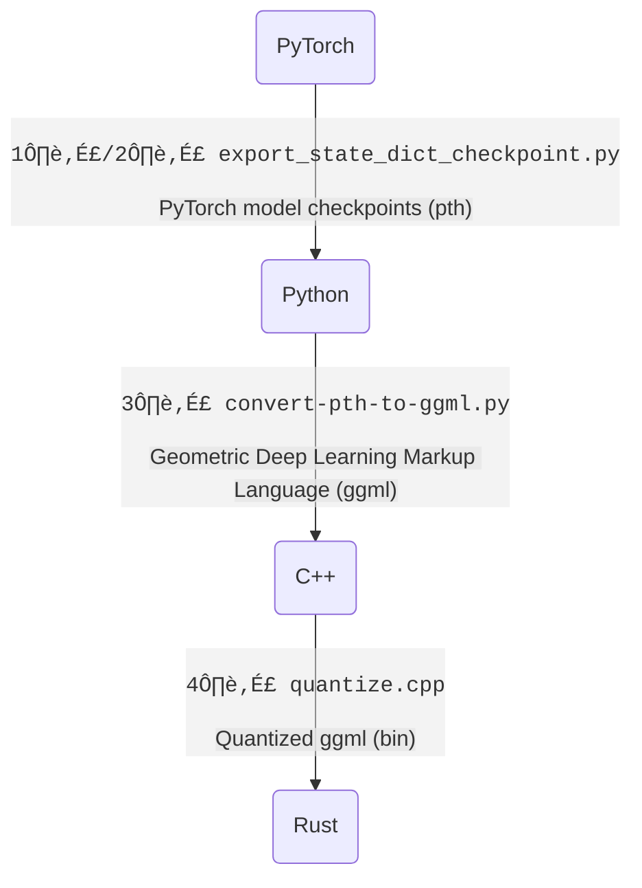

# LLaMA-rs

**LLaMA-rs** is a Rust port of the
[llama.cpp](https://github.com/ggerganov/llama.cpp) project. This allows running
inference for Facebook's [LLaMA](https://github.com/facebookresearch/llama)
model on a CPU with good performance using full precision, f16 or 4-bit
quantized versions of the model.

Just like its C++ counterpart, it is powered by the
[`ggml`](https://github.com/ggerganov/ggml) tensor library, achieving the same performance as the original code.

## Source

- https://github.com/setzer22/llama-rs

## Conversions

> Subject to change to `Rust`.

1️⃣ [tloen/alpaca-lora/export_state_dict_checkpoint.py](https://github.com/tloen/alpaca-lora/blob/main/export_state_dict_checkpoint.py) (llama-7b-hf)  
2️⃣ [jankais3r/LLaMA_MPS/export_state_dict_checkpoint.py](https://github.com/jankais3r/LLaMA_MPS/blob/main/export_state_dict_checkpoint.py) (llama-13b-hf)  
3️⃣ [llama.cpp/convert-pth-to-ggml.py](https://github.com/ggerganov/llama.cpp/blob/master/convert-pth-to-ggml.py)  
4️⃣ [llama.cpp/quantize.cpp](https://github.com/ggerganov/llama.cpp/blob/master/quantize.cpp)

## Raw

> Refer to: https://replicate.com/blog/llama-roundup

### Week 3 of LLaMA 🦙 - Replicate – Replicate

Just three weeks ago, Meta AI released [a new open-source language model called LLaMA](https://ai.facebook.com/blog/large-language-model-llama-meta-ai/). It is not even fully open-source – only the code has been open-sourced and the weights have not been released widely. ([Legitimately, at least.](https://github.com/facebookresearch/llama/pull/73))

Even still, a ridiculous amount of stuff has been built around it.

It feels a lot like [the first few weeks of Stable Diffusion](https://multimodal.art/news/1-week-of-stable-diffusion). Like Stable Diffusion, [LLaMA is easy to run on your own hardware, large enough to be useful, and open-source enough to be tinkered with](https://simonwillison.net/2023/Mar/11/llama/), as Simon Willison articulated earlier this week.

Here’s just a partial list of what's happened this week:

- [llama.cpp](https://github.com/ggerganov/llama.cpp) – A port of LLaMA to C/C++ by Georgi Geranov.
- [Large language models are having their Stable Diffusion moment](https://simonwillison.net/2023/Mar/11/llama/) – A blog post by Simon Willison summarizing some of the things that happened up to this week.
- [Stanford's Alpaca](https://crfm.stanford.edu/2023/03/13/alpaca.html) – A version of LLaMA fine-tuned to follow instructions.
- [Stanford Alpaca, and the acceleration of on-device large language model development](https://simonwillison.net/2023/Mar/13/alpaca/) – A blog post by Simon Willison about Alpaca.
- [Running LLaMA on a Raspberry Pi](https://twitter.com/miolini/status/1634982361757790209) by Artem Andreenko.
- [Running LLaMA on a Pixel 5](https://twitter.com/ggerganov/status/1635605532726681600) by Georgi Gerganov.
- [Run LLaMA and Alpaca with a one-liner](https://cocktailpeanut.github.io/dalai) – `npx dalai llama`
- [alpaca.cpp](https://github.com/antimatter15/alpaca.cpp) – llama.cpp but for Alpaca by Kevin Kwok.
- [Run LLaMA with Cog and Replicate](https://github.com/replicate/cog-llama)
- [Load LLaMA models instantly](https://twitter.com/justinetunney/status/1636628000493174784) by Justine Tunney.
- [Do the LLaMA thing, but now in Rust](https://github.com/setzer22/llama-rs) by setzer22.
- [Train and run Stanford Alpaca on your own machine](https://replicate.com/blog/replicate-alpaca) from us.
- [Alpaca-LoRA: Low-Rank LLaMA Instruct-Tuning](https://github.com/tloen/alpaca-lora) by Eric J. Wang.
- [Fine-tune LLaMA to speak like Homer Simpson](https://replicate.com/blog/fine-tune-llama-to-speak-like-homer-simpson) from us.
- [Llamero](https://github.com/mpociot/llamero/) – A GUI application to easily try out Facebook's LLaMA models by Marcel Pociot.

Open source language models are clearly having a moment. We're looking forward to seeing what happens next week.

[Follow us on Twitter to follow along.](https://twitter.com/replicatehq)

## History

- [llama-py](https://github.com/facebookresearch/llama)
- [llama-cpp](https://github.com/ggerganov/llama.cpp)
- [llama-rs](https://github.com/setzer22/llama-rs)
- [alpaca-cpp](https://github.com/antimatter15/alpaca.cpp)
- [alpaca-py](https://github.com/tatsu-lab/stanford_alpaca)
- [alpaca-lora-py](https://github.com/tloen/alpaca-lora)
