# LLaMA-rs

**LLaMA-rs** is a Rust port of the
[llama.cpp](https://github.com/ggerganov/llama.cpp) project. This allows running
inference for Facebook's [LLaMA](https://github.com/facebookresearch/llama)
model on a CPU with good performance using full precision, f16 or 4-bit
quantized versions of the model.

Just like its C++ counterpart, it is powered by the
[`ggml`](https://github.com/ggerganov/ggml) tensor library, achieving the same performance as the original code.

## Source

- https://github.com/setzer22/llama-rs

## Conversions

> Subject to change to `Rust`.

```mermaid
graph TD;
  A("PyTorch") --"<pre>1️⃣/2️⃣&nbsp;export_state_dict_checkpoint.py</pre>PyTorch model checkpoints (pth)"--> B(Python) --"<pre>3️⃣&nbsp;convert-pth-to-ggml.py</pre>Geometric Deep Learning Markup Language (ggml)"--> C(C++)--"<pre>4️⃣&nbsp;quantize.cpp</pre>Quantized ggml (bin)"-->D(Rust);
```

1️⃣ [tloen/alpaca-lora/export_state_dict_checkpoint.py](https://github.com/tloen/alpaca-lora/blob/main/export_state_dict_checkpoint.py) (llama-7b-hf)  
2️⃣ [jankais3r/LLaMA_MPS/export_state_dict_checkpoint.py](https://github.com/jankais3r/LLaMA_MPS/blob/main/export_state_dict_checkpoint.py) (llama-13b-hf)  
3️⃣ [llama.cpp/convert-pth-to-ggml.py](https://github.com/ggerganov/llama.cpp/blob/master/convert-pth-to-ggml.py)  
4️⃣ [llama.cpp/quantize.cpp](https://github.com/ggerganov/llama.cpp/blob/master/quantize.cpp)

## Raw

> Refer to: https://replicate.com/blog/llama-roundup

### Week 3 of LLaMA 🦙 - Replicate – Replicate

Just three weeks ago, Meta AI released [a new open-source language model called LLaMA](https://ai.facebook.com/blog/large-language-model-llama-meta-ai/). It is not even fully open-source – only the code has been open-sourced and the weights have not been released widely. ([Legitimately, at least.](https://github.com/facebookresearch/llama/pull/73))

Even still, a ridiculous amount of stuff has been built around it.

It feels a lot like [the first few weeks of Stable Diffusion](https://multimodal.art/news/1-week-of-stable-diffusion). Like Stable Diffusion, [LLaMA is easy to run on your own hardware, large enough to be useful, and open-source enough to be tinkered with](https://simonwillison.net/2023/Mar/11/llama/), as Simon Willison articulated earlier this week.

Here’s just a partial list of what's happened this week:

- [llama.cpp](https://github.com/ggerganov/llama.cpp) – A port of LLaMA to C/C++ by Georgi Geranov.
- [Large language models are having their Stable Diffusion moment](https://simonwillison.net/2023/Mar/11/llama/) – A blog post by Simon Willison summarizing some of the things that happened up to this week.
- [Stanford's Alpaca](https://crfm.stanford.edu/2023/03/13/alpaca.html) – A version of LLaMA fine-tuned to follow instructions.
- [Stanford Alpaca, and the acceleration of on-device large language model development](https://simonwillison.net/2023/Mar/13/alpaca/) – A blog post by Simon Willison about Alpaca.
- [Running LLaMA on a Raspberry Pi](https://twitter.com/miolini/status/1634982361757790209) by Artem Andreenko.
- [Running LLaMA on a Pixel 5](https://twitter.com/ggerganov/status/1635605532726681600) by Georgi Gerganov.
- [Run LLaMA and Alpaca with a one-liner](https://cocktailpeanut.github.io/dalai) – `npx dalai llama`
- [alpaca.cpp](https://github.com/antimatter15/alpaca.cpp) – llama.cpp but for Alpaca by Kevin Kwok.
- [Run LLaMA with Cog and Replicate](https://github.com/replicate/cog-llama)
- [Load LLaMA models instantly](https://twitter.com/justinetunney/status/1636628000493174784) by Justine Tunney.
- [Do the LLaMA thing, but now in Rust](https://github.com/setzer22/llama-rs) by setzer22.
- [Train and run Stanford Alpaca on your own machine](https://replicate.com/blog/replicate-alpaca) from us.
- [Alpaca-LoRA: Low-Rank LLaMA Instruct-Tuning](https://github.com/tloen/alpaca-lora) by Eric J. Wang.
- [Fine-tune LLaMA to speak like Homer Simpson](https://replicate.com/blog/fine-tune-llama-to-speak-like-homer-simpson) from us.
- [Llamero](https://github.com/mpociot/llamero/) – A GUI application to easily try out Facebook's LLaMA models by Marcel Pociot.

Open source language models are clearly having a moment. We're looking forward to seeing what happens next week.

[Follow us on Twitter to follow along.](https://twitter.com/replicatehq)

## Relation

```mermaid
graph LR;
A --> AA("LLaMA_MPS 🐍")
A("llama 🐍") --"4-bit"--> B("llama 🐇")
B --> C("llama-rs 🦀")
A --"16,32-bit"--> CC("RLLaMA 🦀")
C --"napi-rs"--> I("llama-node 🐥")
B --"fine-tuning to obey ix"--> D("alpaca 🐇")
A --> E("alpaca 🐍") --LoRa--> F("alpaca-lora 🐍")
E --instruction-following--> H("codealpaca 🐍")
D --"fine-tunes the GPT-J 6B"--> DD("dolly 🐍")
D --"instruction-tuned Flan-T5"--> DDD("flan-alpaca 🐍")
B --> BB("bloomz 🐇")
BB --LoRA--> DDDD("BLOOM-LoRA 🐍")
D --Alpaca_data_cleaned.json--> DDDD("BLOOM-LoRA 🐍")
```

- [llama 🐍](https://github.com/facebookresearch/llama): Open and Efficient Foundation Language Models.
- [LLaMA_MPS 🐍](https://github.com/jankais3r/LLaMA_MPS): Run LLaMA (and Stanford-Alpaca) inference on Apple Silicon GPUs.
- [llama 🐇](https://github.com/ggerganov/llama.cpp): Inference of LLaMA model in pure C/C++.
- [alpaca 🐇](https://github.com/antimatter15/alpaca.cpp): This combines the LLaMA foundation model with an open reproduction of Stanford Alpaca a fine-tuning of the base model to obey instructions (akin to the RLHF used to train ChatGPT) and a set of modifications to llama.cpp to add a chat interface.
- [llama-rs 🦀](https://github.com/setzer22/llama-rs): Do the LLaMA thing, but now in Rust 🦀🚀🦙
- [alpaca 🐍](https://github.com/tatsu-lab/stanford_alpaca): Stanford Alpaca: An Instruction-following LLaMA Model
- [codealpaca 🐍](https://github.com/sahil280114/codealpaca): An Instruction-following LLaMA Model trained on code generation instructions.
- [alpaca-lora 🐍](https://github.com/tloen/alpaca-lora): Low-Rank LLaMA Instruct-Tuning
- [llama-node 🐥](https://github.com/hlhr202/llama-node): nodejs client library for llama LLM built on top of llama-rs. It uses napi-rs as nodejs and native communications.
- [RLLaMA 🦀](https://github.com/Noeda/rllama): Rust+OpenCL+AVX2 implementation of LLaMA inference code.
- [Dolly 🐍](https://github.com/databrickslabs/dolly): This fine-tunes the GPT-J 6B model on the Alpaca dataset using a Databricks notebook.
- [Flan-Alpaca 🐍](https://github.com/declare-lab/flan-alpaca): Instruction Tuning from Humans and Machines.
- [bloomz 🐇](https://github.com/NouamaneTazi/bloomz.cpp): Inference of HuggingFace's BLOOM-like models in pure C/C++ built on top of the amazing llama.cpp.
- [BLOOM-LoRA 🐍](https://github.com/linhduongtuan/BLOOM-LORA): Low-Rank LLaMA Instruct-Tuning.

## Tools

```mermaid
graph LR;
A("🐍 langchain")
A --> AA("🐥 langchainjs")
AA --> B("🐥 langchain-alpaca")
D("🐇 alpaca") --> B
E-->D
E("🐇 llama") --ggml/13B--> H
F("🐇 whisper") --> H
H("🐇 talk")
```

- [🐍 langchain](https://github.com/hwchase17/langchain): Building applications with LLMs through composability.
- [🐥 langchainjs](https://github.com/hwchase17/langchainjs): langchain in js.
- [🐥 langchain-alpaca](https://github.com/linonetwo/langchain-alpaca): Run alpaca LLM fully locally in langchain.
- [🐇 whisper](https://github.com/ggerganov/whisper.cpp): High-performance inference of OpenAI's Whisper automatic speech recognition (ASR) model.
- [🐇 talk](https://github.com/ggerganov/whisper.cpp/tree/master/examples/talk): Talk with an Artificial Intelligence in your terminal.

## Serve

- [Code Alpaca](https://huggingface.co/spaces/sahil2801/CodeAlpaca): The Code Alpaca models are fine-tuned from a 7B and 13B LLaMA model on 20K instruction-following data generated by the techniques in the Self-Instruct [1] paper, with some modifications that we discuss in the next section. Evals are still a todo.
- [Alpaca-LoRA-Serve](https://huggingface.co/spaces/chansung/Alpaca-LoRA-Serve): Instruction fine-tuned version of LLaMA from Meta AI. Alpaca-LoRA is Low-Rank LLaMA Instruct-Tuning which is inspired by Stanford Alpaca project. This demo application currently runs 7B version on a T4 instance.
