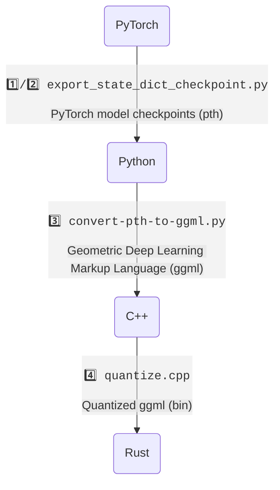

# ML

 I'll noted about ML here, still ongoing!

## Goals

- Try to catch up ML knowledge first.
- Categorize later.

## Conversions

1️⃣ [tloen/alpaca-lora/export_state_dict_checkpoint.py](https://github.com/tloen/alpaca-lora/blob/main/export_state_dict_checkpoint.py) (llama-7b-hf)  
2️⃣ [jankais3r/LLaMA_MPS/export_state_dict_checkpoint.py](https://github.com/jankais3r/LLaMA_MPS/blob/main/export_state_dict_checkpoint.py) (llama-13b-hf)  
3️⃣ [llama.cpp/convert-pth-to-ggml.py](https://github.com/ggerganov/llama.cpp/blob/master/convert-pth-to-ggml.py)  
4️⃣ [llama.cpp/quantize.cpp](https://github.com/ggerganov/llama.cpp/blob/master/quantize.cpp)
