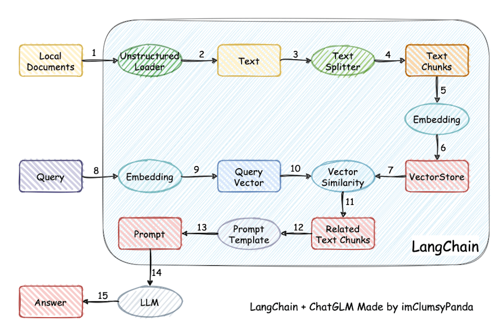

# Retrieval Augmented Generation (RAG)

## Overview



> ref: https://github.com/chatchat-space/Langchain-Chatchat/blob/master/README_en.md

## My Pick

- [`RIG`]: [Build modular and scalable LLM Applications in Rust](https://rig.rs/)
- [LlamaEdge](https://github.com/LlamaEdge/Example-LlamaEdge-RAG)

## Raw

- [Basic RAG](https://docs.mistral.ai/guides/basic-RAG/)
- [RAG with LlamaIndex - Nvidia CUDA + WSL + Word documents + Local LLM](https://github.com/marklysze/LlamaIndex-RAG-WSL-CUDA)
- [LlamaHub 🦙](https://github.com/run-llama/llama-hub)

## Examples

### Mistral-7B-Instruct Multiple-PDF Chatbot with Langchain & Streamlit

> Fixed notebook: [Chat_with_MultiplePDFs_Mistral_7B_Instruct1.ipynb](./Chat_with_MultiplePDFs_Mistral_7B_Instruct1.ipynb)

- YouTube: https://www.youtube.com/watch?v=tqpXvPzteT4
- Colab: https://colab.research.google.com/drive/11sf5LAF5EC1M0cDh-pUyowvS7EflwlMH?usp=sharing
- ⚠️ This notebook doesn't use GPU. To add GPU support:
  ```bash
  !CMAKE_ARGS="-DLLAMA_CUBLAS=on" FORCE_CMAKE=1 pip install llama-cpp-python
  ```
  and
  ```python
  llm = LlamaCpp(
    streaming = True,
    model_path="./mistral-7b-instruct-v0.1.Q4_K_M.gguf",
    temperature=0.75,
    top_p=1,
    verbose=True,
    n_ctx=4096,
    n_gpu_layers=30,
    n_threads=2,
    n_batch=521,
  )
  ```
