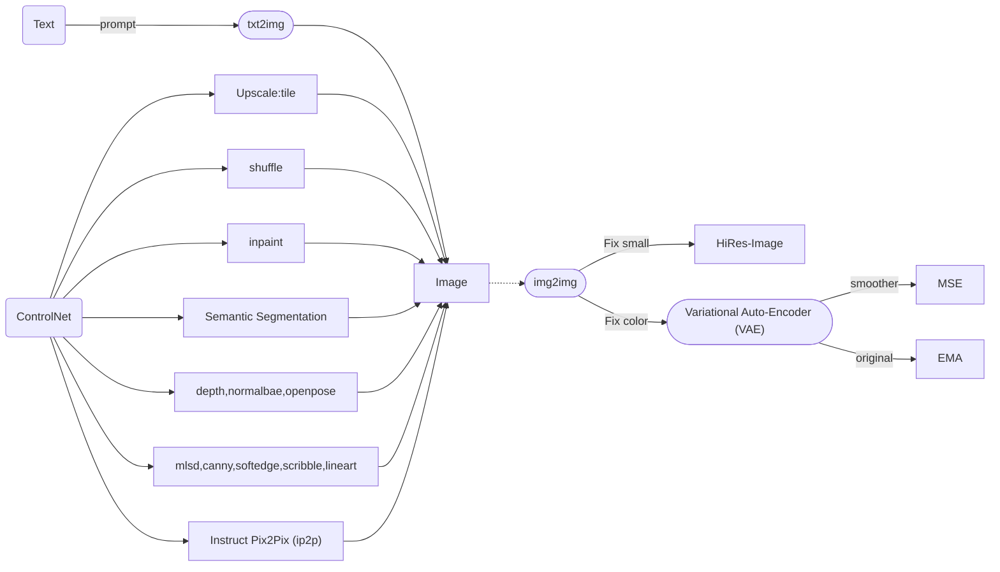
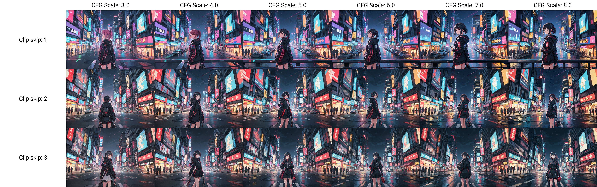
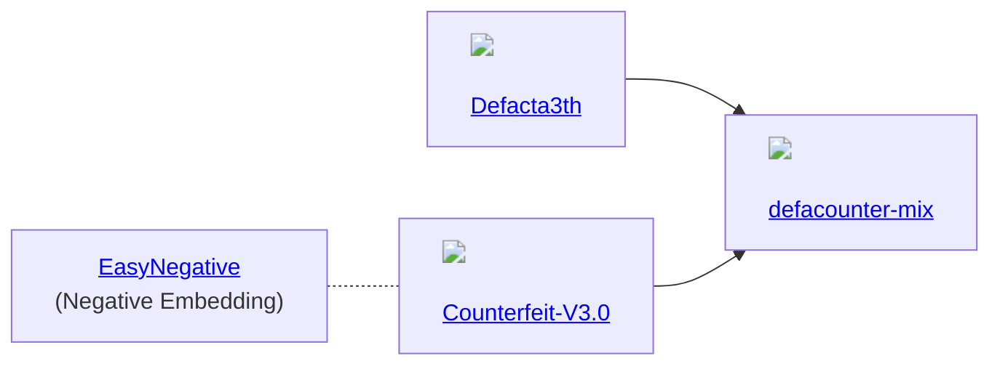

# Stable Diffusion

## Overview


## Basic
### Glossaries
> Base knowledge for starter.
- `txt2img`
  - `Prompts`: Syntax (`()`, `<>`), Checkpoints // What we want in text.
  - `Negative Prompts`: Textual Inversion // What we not want in text.
  - `LoRA`: Modify cross-attention at weight // Change final image to what we want.
  - `Hypernetworks`: Modify cross-attention by insert additional networks. // Process image to what we want. (Prefer `LoRA`)
  - `Embeddings`: Result of fine-tuning (Textual Inversion). // Define new word to certain style.
- `img2img` // Draw something like this.
- `VAE`: Variational Auto-Encoder // Fix washout color.
- `Hires.fix` // Upscale with some fix.

### UI
> You will need some ui for generate some cool picture.
- `WEB` [Stable Diffusion web UI](https://github.com/AUTOMATIC1111/stable-diffusion-webui): A browser interface based on Gradio library for Stable Diffusion. // Most famous.
- `WEB` [vladmandic/automatic](https://github.com/vladmandic/automatic): Forked of `AUTOMATIC1111` + Advanced CUDA tuning

### Prompts
- You can use `BREAK` to end current and not influent next word. [ref](https://br-d.fanbox.cc/posts/5731955)
  ```
  absurdres , highres, ultra detailed, (1girl:1.3),
  BREAK
  solarization, inverted tones, experimental photography, surreal contrast, striking visuals, artistic abstraction,
  BREAK
  paper cut art, layered silhouettes, intricate patterns, delicate craftsmanship, shadow play, depth and dimension, creative expression,
  BREAK
  ice art, frozen sculptures, translucent forms, ephemeral beauty, crystalline textures, delicate craftsmanship, chilling allure,
  BREAK
  green eyes,
  ```

### Negative Prompts
> You will need these unwanted prompts to prevent bad hand.
- [bad_prompt_version2](https://huggingface.co/datasets/Nerfgun3/bad_prompt/resolve/main/bad_prompt_version2.pt)
- [bad-hands-5](https://huggingface.co/yesyeahvh/bad-hands-5/resolve/main/bad-hands-5.pt)
- [bad-image-v2-39000](https://huggingface.co/Xynon/models/resolve/main/experimentals/TI/bad-image-v2-39000.pt)
- [EasyNegative](https://huggingface.co/datasets/gsdf/EasyNegative/resolve/main/EasyNegative.safetensors): [civitai](https://civitai.com/models/7808/easynegative)
- [EasyNegativeV2](https://huggingface.co/gsdf/Counterfeit-V3.0/resolve/main/embedding/EasyNegativeV2.safetensors)
- [ng_deepnegative_v1_75t](https://civitai.com/api/download/models/5637): [civitai](https://civitai.com/models/4629/deep-negative-v1x)
- [verybadimagenegative_v1.3](https://civitai.com/api/download/models/25820): [civitai](https://civitai.com/models/11772/verybadimagenegative)

### Models
> Model is a new artist. You can find one below anyway consider use `safetensor` because `.ckpt` (aka `.zip`) can [contain harmful script](https://rentry.org/safetensorsguide).
- [Civit AI](https://civitai.com/)
- [Hugging Face](https://huggingface.co/)
- [Official Research Models](https://upscale.wiki/wiki/Official_Research_Models)

### Extensions
- [stable-diffusion-webui-state](https://github.com/ilian6806/stable-diffusion-webui-state): Preserve web UI parameters (inputs, sliders, checkboxes etc.) after page reload.
- [sd-webui-controlnet](https://github.com/Mikubill/sd-webui-controlnet): The WebUI extension for ControlNet and other injection-based SD controls.
- [sd-webui-segment-anything](https://github.com/continue-revolution/sd-webui-segment-anything): Segment Anything for Stable Diffusion WebUI.
- [sd-webui-regional-prompter](https://github.com/hako-mikan/sd-webui-regional-prompter): Set prompt to divided region.
  
- [sd-webui-model-converter](https://github.com/Akegarasu/sd-webui-model-converter): TODO: Replace with about this link.
- [sd-webui-3d-open-pose-editor](https://github.com/nonnonstop/sd-webui-3d-open-pose-editor): TODO: Replace with about this link.
- [sd-3dmodel-loader](https://github.com/jtydhr88/sd-3dmodel-loader): Model convert extension , Used for AUTOMATIC1111's stable diffusion webui.
- [sd-webui-depth-lib](https://github.com/jexom/sd-webui-depth-lib): Depth map library for use with the Control Net extension for Automatic1111/stable-diffusion-webui.
  
- [Latent Couple extension (two shot diffusion port)](https://github.com/opparco/stable-diffusion-webui-two-shot): This extension is an extension of the built-in Composable Diffusion. This allows you to determine the region of the latent space that reflects your subprompts.
- [EbSynth](https://github.com/s9roll7/ebsynth_utility): AUTOMATIC1111 UI extension for creating videos using img2img and ebsynth.
- [DAAM](https://defpoint-ai.com/ai-illustration/prompt-daam/): Diffusion Attentive Attribution Maps. // How much and where is text influenced picture. [](https://github.com/toriato/stable-diffusion-webui-daam)
   

## Advanced
- `Sampler`: Most use `DPM++ 2M Karras`.
  
- `CFGScale`: aka CFG Guidance Scale // Low = creative, High = prompt. [ref](https://blog.openart.ai/2023/02/13/the-most-complete-guide-to-stable-diffusion-parameters/)
  
- `SAM`: Segment Anything // It's a magic wand.
- `AutoSAM`: Auto Segment Anything // It's a lazy magic wand.
- `OpenPose` // Draw human from skelton.
- `3D Model & Pose Loader` // Create skeleton from 3D.
- `Checkpoint Merger` // Mix 2 checkpoint.
- `Train` // Create new model by our pictures.

- [`Real-ESRGAN`](https://github.com/xinntao/Real-ESRGAN): 
- `Clip skip`, `Script-X/Y/Z plot`: To create grid for comparison
  
     
### Modify Model
> You can merge model via `stable-diffusion-web-ui`.



## Rust
### Libraries

- [tch-rs](https://github.com/LaurentMazare/tch-rs): Rust bindings for the C++ api of PyTorch. The goal of the tch crate is to provide some thin wrappers around the C++ PyTorch api (a.k.a. libtorch). It aims at staying as close as possible to the original C++ api.
- [tch-m1](https://github.com/ssoudan/tch-m1): how to use LaurentMazare/tch-rs on M1.
- [burn-rs](https://burn-rs.github.io/): This library strives to serve as a comprehensive deep learning framework, offering exceptional flexibility and written in Rust. Our objective is to cater to both researchers and practitioners by simplifying the process of experimenting, training, and deploying models.
- [diffusers-rs](https://github.com/LaurentMazare/diffusers-rs): An implementation of the diffusers api in Rust.

## ETC

- `2D` - [Graphite](https://github.com/GraphiteEditor/Graphite): Redefining state-of-the-art graphics editing + stable diffusion.
- `Video` - [TemporalKit](https://github.com/CiaraStrawberry/TemporalKit): An all in one solution for adding Temporal Stability to a Stable Diffusion Render via an automatic1111 extension.
- `3D` - [ReMoDiffuse](https://mingyuan-zhang.github.io/projects/ReMoDiffuse.html): ReMoDiffuse is a retrieval-augmented 3D human motion diffusion model. Benefiting from the extra knowledge from the retrieved samples, ReMoDiffuse is able to achieve high-fidelity on the given prompts.
- `Blender` - [Dream Texture](https://github.com/carson-katri/dream-textures): Stable Diffusion built-in to Blender.
- [ControlNetMediaPipeFace](https://huggingface.co/spaces/CrucibleAI/ControlNetMediaPipeFaceSD21): Control Stable Diffusion with a Facial Pose
