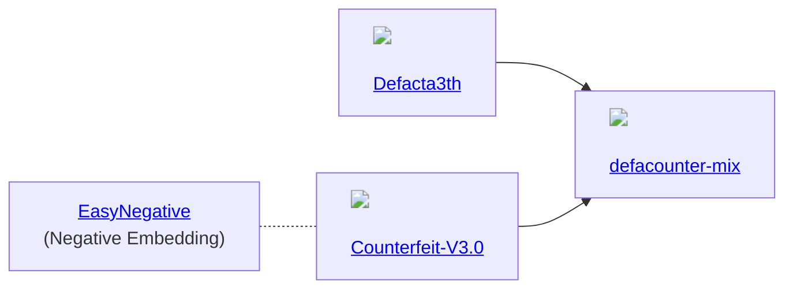

## Stable Diffusion

### Glossaries

- `txt2img`
  - `Prompt`: Syntax (`()`, `<>`), Checkpoints // What we want in text.
  - `Negative Prompt`: Textual Inversion // What we not want in text.
  - `LoRA`: Modify cross-attention at weight // Change final image to what we want.
  - `Hypernetworks`: Modify cross-attention by insert additional networks. // Process image to what we want. (Prefer `LoRA`)
  - `Embeddings`: Result of fine-tuning (Textual Inversion). // Define new word to certain style.
- `img2img` // Draw something like this.
- `VAE`: Variational Auto-Encoder // Fix washout color.
- `SAM`: Segment Anything // It's a magic wand.
- `AutoSaM`: Auto Segment Anything // It's a lazy magic wand.
- `Hires.fix` // Upscale with some fix.
- `OpenPose` // Draw human from skelton.
- `3D Model & Pose Loader` // Create skeleton from 3D.
- `Checkpoint Merger` // Mix 2 checkpoint.
- `Train` // Create new model by our pictures.

## Models

## Library

- [tch-rs](https://github.com/LaurentMazare/tch-rs): Rust bindings for the C++ api of PyTorch. The goal of the tch crate is to provide some thin wrappers around the C++ PyTorch api (a.k.a. libtorch). It aims at staying as close as possible to the original C++ api.
- [tch-m1](https://github.com/ssoudan/tch-m1): how to use LaurentMazare/tch-rs on M1.
- [burn-rs](https://burn-rs.github.io/): This library strives to serve as a comprehensive deep learning framework, offering exceptional flexibility and written in Rust. Our objective is to cater to both researchers and practitioners by simplifying the process of experimenting, training, and deploying models.
- [diffusers-rs](https://github.com/LaurentMazare/diffusers-rs): An implementation of the diffusers api in Rust.

## UI

- [Stable Diffusion web UI](https://github.com/AUTOMATIC1111/stable-diffusion-webui): A browser interface based on Gradio library for Stable Diffusion.
- [sd-webui-controlnet](https://github.com/Mikubill/sd-webui-controlnet): (WIP) WebUI extension for ControlNet and other injection-based SD controls.
- [Regional Prompter](https://github.com/hako-mikan/sd-webui-regional-prompter): Different prompts can be specified for different regions

## Integrations

- `2D` - [Graphite](https://github.com/GraphiteEditor/Graphite): Redefining state-of-the-art graphics editing + stable diffusion.
- `Video` - [TemporalKit](https://github.com/CiaraStrawberry/TemporalKit): An all in one solution for adding Temporal Stability to a Stable Diffusion Render via an automatic1111 extension.
- `3D` - [ReMoDiffuse](https://mingyuan-zhang.github.io/projects/ReMoDiffuse.html): ReMoDiffuse is a retrieval-augmented 3D human motion diffusion model. Benefiting from the extra knowledge from the retrieved samples, ReMoDiffuse is able to achieve high-fidelity on the given prompts.
- `Blender` - [Dream Texture](https://github.com/carson-katri/dream-textures): Stable Diffusion built-in to Blender.

## Extras

- [ControlNetMediaPipeFace](https://huggingface.co/spaces/CrucibleAI/ControlNetMediaPipeFaceSD21): Control Stable Diffusion with a Facial Pose
