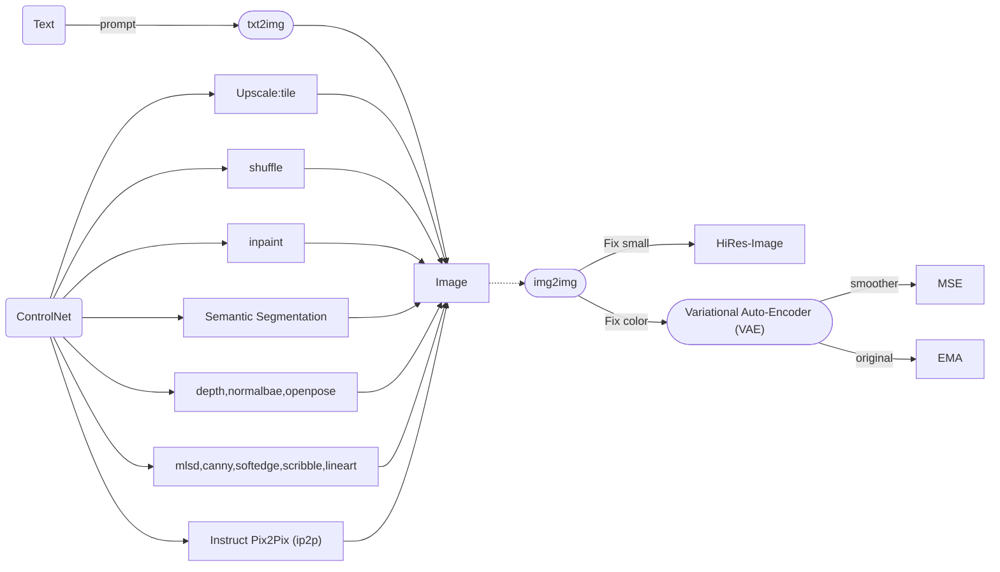
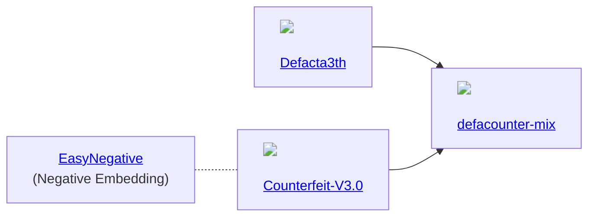

## Stable Diffusion

## Models

## Library

- [tch-rs](https://github.com/LaurentMazare/tch-rs): Rust bindings for the C++ api of PyTorch. The goal of the tch crate is to provide some thin wrappers around the C++ PyTorch api (a.k.a. libtorch). It aims at staying as close as possible to the original C++ api.
- [tch-m1](https://github.com/ssoudan/tch-m1): how to use LaurentMazare/tch-rs on M1.
- [burn-rs](https://burn-rs.github.io/): This library strives to serve as a comprehensive deep learning framework, offering exceptional flexibility and written in Rust. Our objective is to cater to both researchers and practitioners by simplifying the process of experimenting, training, and deploying models.
- [diffusers-rs](https://github.com/LaurentMazare/diffusers-rs): An implementation of the diffusers api in Rust.

## 3D

- [ReMoDiffuse](https://mingyuan-zhang.github.io/projects/ReMoDiffuse.html): ReMoDiffuse is a retrieval-augmented 3D human motion diffusion model. Benefiting from the extra knowledge from the retrieved samples, ReMoDiffuse is able to achieve high-fidelity on the given prompts.

## ControlNet

- [ControlNetMediaPipeFace](https://huggingface.co/spaces/CrucibleAI/ControlNetMediaPipeFaceSD21)

## Blender

- [Dream Texture](https://github.com/carson-katri/dream-textures): Stable Diffusion built-in to Blender.

## 2D

- [Graphite](https://github.com/GraphiteEditor/Graphite): Redefining state-of-the-art graphics editing + stable diffusion.
