# String

> 🤔 [refer to Will Crichton](https://twitter.com/wcrichton/status/1608632382256746498)

```rust,editable
let s1 = String::from("Hello ");
```

```bob

 Stack
+--------------------------------------------------+
|   String                                         |
|  +----------------------------------------------+|
|  |    Vec                                       ||
|  |   +-----------------------------------------+||
|  |   |    RawVec                               |||
|  |   |   +-------+----------------------------+|||
|  |   |   |       | Unique                     ||||
|  |   |   |       |+---------+----------------+||||
|  |   |   |       ||         | NonNull        |||||
|  |   |   |       ||         |+---------+----+|||||
|s1|vec|buf|  ptr  || pointer || pointer | 72 ||||||
|  |   |   |       ||         |+---------+----+|||||
|  |   |   |       |+---------+----------------+||||
|  |   |   |       || _marker |  PhantomData   |||||
|  |   |   |       |+---------+----------------+||||
|  |   |   +-------+----------------------------+|||
|  |   |   |  cap  | 6                          ||||
|  |   |   +-------+----------------------------+|||
|  |   |   | alloc | Global                     ||||
|  |   |   +-------+----------------------------+|||
|  |   +-----+-----------------------------------+||
|  |   | len | 6                                 |||
|  |   +-----+-----------------------------------+||
|  +----------------------------------------------+|
+--------------------------------------------------+
```

> 🤔 [refer to Swatinem](https://swatinem.de/blog/optimized-strings/)

| Name          | Size of `<T>` | Size of `<Option<T>>` | Clone | SSO     | Mutable |
| ------------- | ------------: | --------------------: | ----- | ------- | ------- |
| String        |            24 |                    24 | O(n)  | -       | yes     |
| Arc<str>      |            16 |                    16 | O(1)  | -       | no      |
| arcstr        |             8 |                     8 | O(1)  | -       | no      |
| smol_str      |            24 |                    24 | O(1)  | 23      | no      |
| kstring (arc) |            24 |                    32 | O(1)  | 15 / 22 | no      |
| flexstr       |            24 |                    32 | O(1)  | 22      | no      |
| compact_str   |            24 |                    24 | O(n)  | 24      | yes     |
| smartstring   |            24 |                    32 | O(n)  | 23      | yes     |

> 🤔 [refer to Matt Davies](https://dev.to/cthutu/rust-8-strings-53o)

```mermaid
graph TD
    subgraph "🦀 Strings"
        &Path --to_path_buf--> PathBuf
        PathBuf --into_os_string--> OsString
        PathBuf --as_path--> &Path
        &Path --as_os_str--> &OsStr
        OsString --into_string?--> String
        OsString --as_os_str--> &OsStr
        &OsStr --to_os_string--> OsString
        &OsStr --to_str?--> &str
        String --as_str--> &str
        CString --as_c_str--> &CStr
        CString --into_string?--> String
        &CStr --to_str?-->&str
        String --as_bytes--> u8["&[u8]"]
        &str --as_bytes--> u8["&[u8]"]
        &CStr --to_bytes--> u8["&[u8]"]
        CString --as_bytes--> u8["&[u8]"]
        &str --as_ptr--> cu8["*const u8"]
    end
```


