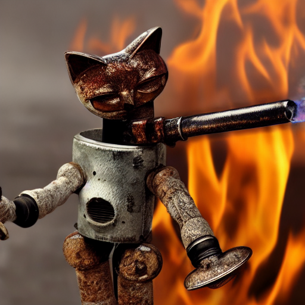

# Rust Stable Diffusion with diffuser-rs




## Perquisites

1. Source code: [diffusers-rs](https://github.com/LaurentMazare/diffusers-rs)
1. `HUGGINGFACE_TOKEN` : Get it from [here](https://huggingface.co/settings/tokens).
1. weights : [1.5](https://huggingface.co/lmz/rust-stable-diffusion-v1-5/tree/main/weights) or [2.1](https://huggingface.co/lmz/rust-stable-diffusion-v2-1/tree/main/weights)

## Manual Setup

For `huggingface` model `v1.5`, This will manual convert the weights so you will need installed `Python`, `numpy`, `PyTorch`.

```
git clone https://github.com/LaurentMazare/diffusers-rs
cd diffusers-rs
. ./scripts/download_weights.sh REPLACE_HERE_WITH_YOUR_HUGGINGFACE_TOKEN
```

## Lazy Setup

For `huggingface` model `v1.5`

```shell
mkdir -p data
wget https://huggingface.co/lmz/rust-stable-diffusion-v1-5/resolve/main/weights/bpe_simple_vocab_16e6.txt -P data/
wget https://huggingface.co/lmz/rust-stable-diffusion-v1-5/resolve/main/weights/pytorch_model.ot -P data/
wget https://huggingface.co/lmz/rust-stable-diffusion-v1-5/resolve/main/weights/unet-inpaint.ot -P data/
wget https://huggingface.co/lmz/rust-stable-diffusion-v1-5/resolve/main/weights/unet.ot -P data/
wget https://huggingface.co/lmz/rust-stable-diffusion-v1-5/resolve/main/weights/vae.ot -P data/
```

For `huggingface` model `v2.1`

```shell
mkdir -p data
wget https://huggingface.co/lmz/rust-stable-diffusion-v2-1/resolve/main/weights/bpe_simple_vocab_16e6.txt -P data/
wget https://huggingface.co/lmz/rust-stable-diffusion-v2-1/resolve/main/weights/clip_v2.1.ot -P data/
wget https://huggingface.co/lmz/rust-stable-diffusion-v2-1/resolve/main/weights/unet_v2.1.ot -P data/
wget https://huggingface.co/lmz/rust-stable-diffusion-v2-1/resolve/main/weights/vae_v2.1.ot -P data/
```

## Run

For `huggingface` model `v1.5` (has flag `--sd-version v1-5`)

```
cargo run --example stable-diffusion --features clap -- --prompt "A rusty cat robot holding a fire torch." --sd-version v1-5
```

For `huggingface` model `v2.1`

```
cargo run --example stable-diffusion --features clap -- --prompt "A rusty cat robot holding a fire torch."
```
