# Async

> 🤔 refer to [The State of Async Rust](https://corrode.dev/blog/async/)

## The State

```mermaid
graph LR;
A("Async madness")
A-.Try to cover Rust standard.->C("async-std<br/>abandoned 😱")
A-.Try to cover any runtime.->B("Tokio<br/>Multi threaded by default = complex 🫠")
```



## Async vs Threads

### Threads

```rust,editable
use std::error::Error;
use std::fs::File;
use std::io::Read;
use std::path::Path;
use std::{thread, time};

// This fn could be used by both async and sync callers,
// eliminating the need for an asynchronous runtime.
fn read_contents<T: AsRef<Path>>(file: T) -> Result<String, Box<dyn Error>> {
    let mut file = File::open(file)?;
    let mut contents = String::new();
    file.read_to_string(&mut contents)?;
    return Ok(contents);
}

fn main() {
    thread::scope(|scope| {
        // worker thread 1
        scope.spawn(|| {
            let contents = read_contents("foo.txt");
            // do something with contents
        });

        // worker thread 2
        scope.spawn(|| {
            let contents = read_contents("bar.txt");
            // ...
        });

        // worker thread 3
        scope.spawn(|| {
            let contents = read_contents("baz.txt");
            // ...
        });
    });

    // Threads get joined automatically
}
```

### Async

```rust,editable
#[tokio::main]
async fn main() {
    // This will print a warning, but compile and do nothing at runtime
    read_contents("foo.txt");
    // futures do nothing unless you `.await` or poll them
}
```

> 🤔 refer to [Asynchronous Programming in Rust](https://rust-lang.github.io/async-book/01_getting_started/02_why_async.html#async-vs-threads-in-rust)

 <span class="speech-bubble">If you don't need async for performance reasons, threads can often be the simpler alternative.</span>

## Best practices

1. `synchronous` by default.
1. opt into `async` as needed.
1. less main with `#[tokio::main]`.

```rust,no_run
#[get("/")]
fn index() -> impl Response {
    let users = db::get_users();
    Response::ok().body(render_template("index.html", users))
}

// A route, which profits from concurrent IO
// It sends multiple requests to an external API and aggregates the results
// Note how the function itself is does not need to be async
#[get("/users")]
fn users(count: usize) -> impl Response {
    // Start a local, single-threaded runtime with smol's async-executor
    let rt = smol::LocalExecutor::new();

    // Run the async code on the runtime
    let results = rt.run(async {
        let mut results = Vec::new();
        for id in 0..count {
            let result = reqwest::get(format!("https://api.example.com/users/{}", id)).await?;
            results.push(result);
        }
        Ok(results)
    });

    Response::ok().body(render_template("users.html", results))
}

// This does not need to be async either!
// In the background, it might use a thread pool to handle multiple requests
fn main() -> Result<()> {
    let app = App::new()
        .mount("/", index)
        .mount("/users", users)
        .run();
}
```

 <span class="speech-bubble">Read more 👉 [Asynchronous Programming in Rust](https://rust-lang.github.io/async-book/01_getting_started/01_chapter.html)</span>
