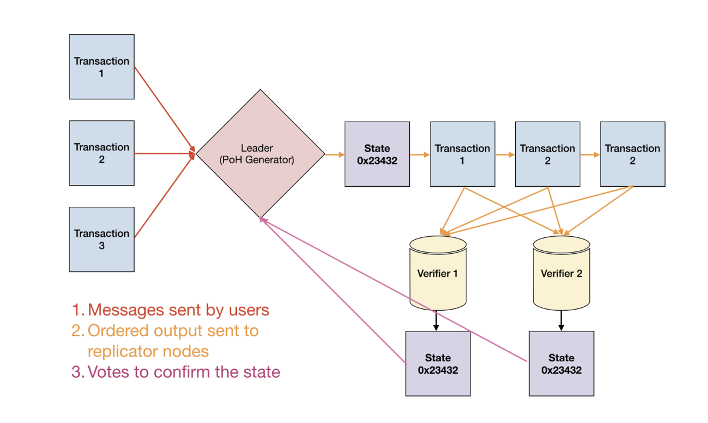
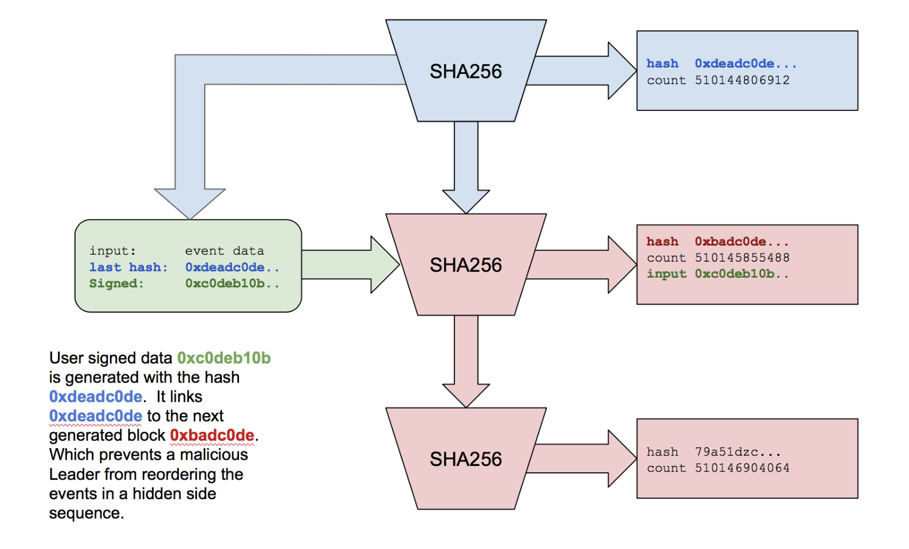
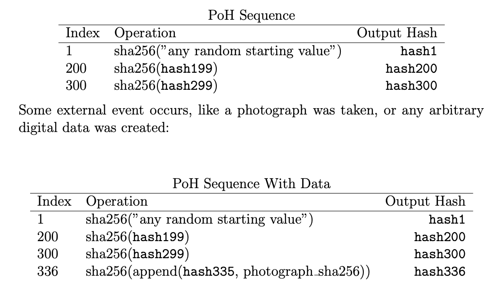
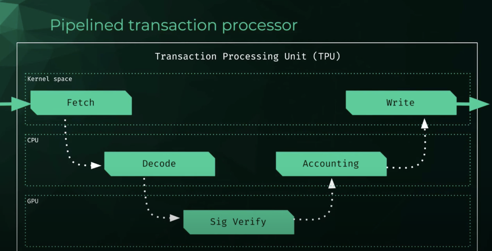
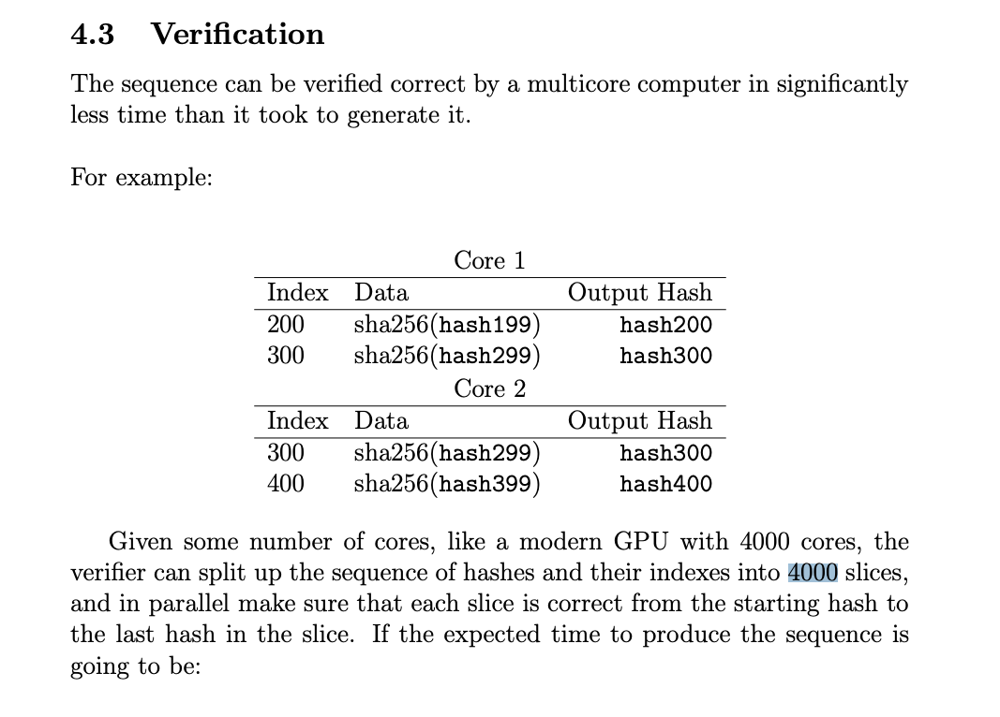
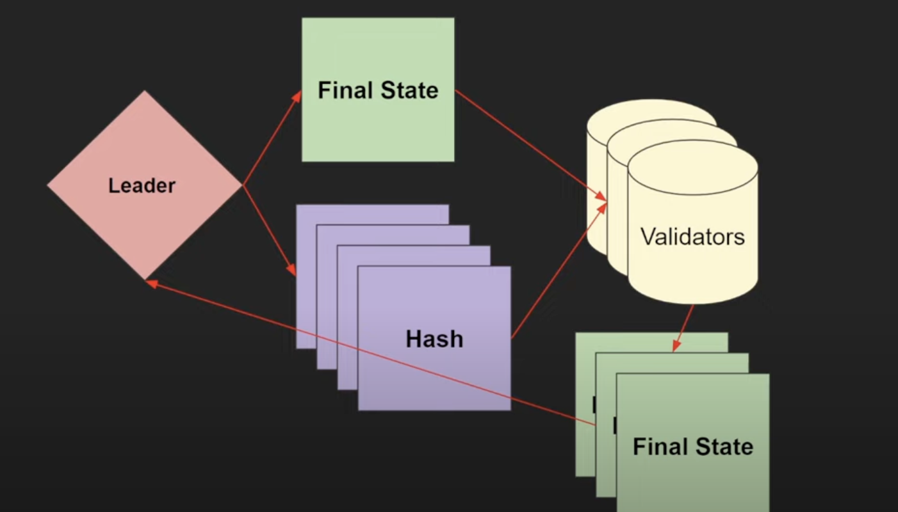
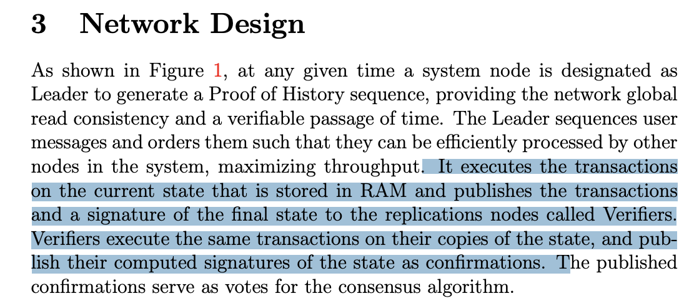

# Consensus 
Solana combine two consensus algorithms PoS and enhance with PoH
> 🚧 Main focus on Proof of History (PoH)

> 🚧 Listen Approach to Scalability to understand what solana achieve [here](https://www.youtube.com/watch?v=50yhHe_NQ0g&t)

## PoH (Proof of history)
> 🚧 Key point: ***Take notion of time into blockchain***, 
PoH Create verifyable time ordering to allow validator nodes to determine the order of incoming blocks.

Look at this diagram (a bit confusion)

> ref: https://solana.com/solana-whitepaper.pdf

 <span class="speech-bubble">If you're confused, that's fine! Let's break it down part by part.</span>

Explain diagram 
Transaction coming into solana cluster and then 

1. Select leader generator (PoH generator) by PoS engine (depending on weight of staking amount, ***more on later***).
2. Leader generates PoH with Hashing algroithm (SHA256)
3. Combine transaction hash with the hash generated by the leader node to produce an output that serves as input for the next hash.
3. validator node verify or recompute the hash that generate by leader and working in parallel with the same mechanism. to confirm each tx happening on correct time (state)

 <span class="speech-bubble">Time ordering and block is generate by leader node !</span>

> 🚧 Unlike other protocols, this one doesn't require validator nodes to produce and broadcast blocks to the entire network. Instead, validators continuously process the hash in pararell to ensure no malicious leader exists. 

 <span class="speech-bubble">That mean schedule with out communication !</span>

## How Hashing ? 
- PoH Hashing sequen
    Leader node will generate hash (SHA256) and the hash can't predict output!
    ```mermaid
        graph LR
         A["🤖 Leader node"]--->B["1️⃣ Hash1 (SHA256)"]--->C["2️⃣ Hash2 (SHA256)"]--->D["3️⃣ Hash3 (SHA256)"]
    ```

- PoH Hashing + transaction hash
    ```mermaid
        graph LR
            A["🤖 Leader node"]--->B["1️⃣ Hash1 (SHA256)"]--->C["2️⃣ Hash2 (SHA256) + Transaction 💵"]--->D["3️⃣ Hash3 (SHA256)"]
    ```

Now user sending incoming transaction


 > combine transaction hash with previos hash as an input. 

 There's a reason why Solana works this way. Let's see in the next topic.  👉

## Notion of the time in PoH 
How solanana put the time to blockchain ? this is genious concept for solana PoH consensus, 

 > Solana uses a sequence of hashes to record event data at the current index of the hashing sequence, like capturing an event at a particular point in the sequence.



> ref: https://solana.com/solana-whitepaper.pdf

for example index 336 will use hash 335 output + tx hash (event) as input.

 <span class="speech-bubble">Now we can determine and know the period during which the transaction occurred: before hash 337 was created and after hash 335.</span>


## How fast ? 
 <span class="speech-bubble">Generate hash (GPU) > Generate hash (CPU)</span>

Let's see transaction piplined


> ref: https://youtu.be/50yhHe_NQ0g?t=253

The verification process happens in the GPU section (utilizing the GPU's multiple cores to recompute the hash in parallel). That's why it's not slow even though it recomputes the hash.

And exactly is implement by power of RUST!! 🦀



> ref: https://solana.com/solana-whitepaper.pdf

## How verifying ?

now we don't worry about recompute will be slow, cause solana use multicore from GPU to recompute for verifying,

now we focus on how it verifying process

 

> ref: https://youtu.be/079mUCjYpZs?t=798

> 🚧 Validator node will verify hash in pararell, by using the same machanism to recompute hash and after got final state that compute with final hash it will checking by sending final state to compare with final state from leader node and then Leader node will commit a block to the ledger.

 

> ref: https://solana.com/solana-whitepaper.pdf

