# NFT Memberships

> 🚧 UNDER CONSTRUCTION: Please bear 🧸 with me! If you can't wait please try [read more](../../bye.md).

## Static Content


## Continue with mobile wallet

```mermaid
sequenceDiagram
  autonumber
  participant wallet as Wallet
  participant browser as Browser
  participant edge as Edge (Worker)
  browser->>wallet: connect
  wallet->>browser: phantom_pubkey, nonce, data
  browser->>edge: /auth/phantom
  Note right of browser: agent=mobile<br>phantom_pubkey, nonce, data
  edge->>edge: decrypt data w/ 🔑 secret_key
  alt Invalid
    edge->>browser: null cookie
    Note left of edge: error
  else Valid
    edge->>browser: httpOnly cookie
    Note left of edge: pubkey, session, data, 🎫 access_token
  end
```



## Continue with web wallet

```mermaid
sequenceDiagram
  autonumber
  participant wallet as Wallet
  participant browser as Browser
  participant edge as Edge (Worker)
  browser->>wallet: connect
  wallet->>browser: wallet_pubkey
    browser->>wallet: sign
  wallet->>browser: signed_wallet_pubkey
  browser->>+edge: /auth/phantom
  Note right of browser: agent=extension<br>signed_wallet_pubkey
  edge->>edge: verify signed_wallet_pubkey
  alt Invalid
    edge->>browser: null cookie
    Note left of edge: error
  else Valid
    edge->>browser: httpOnly cookie
    Note left of edge: pubkey, session, data, 🎫 access_token
  end
```



## Paywalls Content

### Flow (with `access_token` via server side cookie)

```mermaid
sequenceDiagram
  autonumber
  participant browser as Browser
  participant edge as Edge (Worker)
  participant cf_kv as Edge (KV)
  participant mdbook as mdbook
  mdbook->>cf_kv: key: nft_address, value: content_id
  browser->>+edge: /view/{nft_address}
  Note right of browser: 🎫 access_token
  edge->>edge: Verify 🎫 access_token
  edge->>edge: Validate member by<br>user_pubkey held valid nft::mint
  edge->>edge: Validate expiry by<br>derived nft.data.expired_at
  edge->>cf_kv: get contents
  cf_kv->>edge: contents
  edge->>-browser: contents
```



### Known Limits

- Can be slow to query if has a number of holding `NFTs`.
- Required `cookie`.

### How to use

```html
<nft network="devnet" address="8N6BAdK88vc2Nbrqviggk4kigyFbud2QjAap7Nq3KePN">
  <button>🔑 continue with wallet</button>
</nft>
```

### Demo

1. <button id="w3-connect">Continue with wallet</button>
1. <button id="w3-register">Sign pubkey to login</button>
1. <button id="w3-stake">Stake to get NFT membership</button>
1. <button id="w3-unstake">Unstake to cancel membership</button>
1. <button id="w3-disconnect">Signout</button>

<br/>
<nft src="solana::devnet::8N6BAdK88vc2Nbrqviggk4kigyFbud2QjAap7Nq3KePN">
</nft>
<br/>
<br/>

### Source

- TODO

---

### Alternative

<details>
  <summary>
  Paywalls Content (ALTs)
  </summary>

## Paywalls Content (ALTs)

> Use Address Lookup Tables as indexing.


### Pros

- Direct map
- Less query overhead for <256 members.

### Cons

- Limited to 256 accounts.
- Need upfront record and maintain.

</details>
