# NFT Memberships

> 🚧 UNDER CONSTRUCTION: Please bear 🧸 with me! If you can't wait please try [read more](../../bye.md).

## Static Content


## Continue with mobile wallet

```mermaid
sequenceDiagram
  autonumber
  participant wallet as Wallet
  participant browser as Browser
  participant edge as Edge (Worker)
  browser->>wallet: connect
  wallet->>browser: phantom_pubkey, nonce, data
  browser->>edge: /auth/phantom
  Note right of browser: agent=mobile<br>phantom_pubkey, nonce, data
  edge->>edge: decrypt data w/ 🔑 secret_key
  alt Invalid
    edge->>browser: null cookie
    Note left of edge: error
  else Valid
    edge->>browser: httpOnly cookie
    Note left of edge: 🎫 web3_token = { wallet_pubkey, <br>provider:{ name, session, data } }
  end
```



## Continue with web wallet

```mermaid
sequenceDiagram
  autonumber
  participant wallet as Wallet
  participant browser as Browser
  participant edge as Edge (Worker)
  browser->>wallet: connect
  wallet->>browser: wallet_pubkey
    browser->>wallet: sign
  wallet->>browser: signed_wallet_pubkey
  browser->>+edge: /auth/phantom
  Note right of browser: agent=extension<br>signed_wallet_pubkey
  edge->>edge: verify signed_wallet_pubkey
  alt Invalid
    edge->>browser: null cookie
    Note left of edge: error
  else Valid
    edge->>browser: httpOnly cookie
    Note left of edge: 🎫 web3_token = { wallet_pubkey, <br>provider:{ name, session, data } }
  end
```



## NFT Mint Content


## NFT Paywalls Content

### Flow (with `web3_token` via server side cookie)

```mermaid
sequenceDiagram
  autonumber
  participant browser as Browser
  participant edge as Edge (Worker)
  participant cf_kv as Edge (KV)
  participant chain as Chain

  browser->>+edge: /nft/{mint_address}
  Note right of browser: 🎫 web3_token

  alt validate internal
    edge->>edge: Verify 🎫 web3_token
    edge->>browser: error: invalid
  end

  alt validate external
    edge->>chain: Get wallet PDA mint_address
    chain->>edge: token account
    Note left of chain: mint: address, amount
    edge->>edge: Validate by mint_amount > 0
    edge->>edge: Validate by PDA mint_address
    edge->>chain: Get mint metadata
    chain->>edge: metadata
    Note left of chain: Metaplex::DataV2
    edge->>browser: error: invalid
  end

  alt validate state
    edge->>cf_kv: get url
    Note right of edge: mint_address
    edge->>edge: Validate by KV mint_address
    edge->>browser: error: invalid
  else
    cf_kv->>edge: url
    Note left of cf_kv: KV: mint_address → url
  end

  edge->>edge: handle Metaplex::DataV2
  edge->>cf_kv: get content from metadata.uri
  Note right of edge: uri
  cf_kv->>edge: content
  edge->>browser: content

```



### Known Limits

- Can be slow to query if has a number of holding `NFTs`.
- Required `cookie`.

### How to use

```html
<nft data-chain="solana" data-cluster="mainnet-beta" src="8N6BAdK88vc2Nbrqviggk4kigyFbud2QjAap7Nq3KePN">
  <button>🔑 continue with wallet</button>
</nft>
```

### Demo

1. <a href="https://gist.rs/wallet/connect/?redirect_uri=https://book.gist.rs/solana/nft-memberships.html#demo">Continue with wallet</a>
1. <a href="https://gist.rs/wallet/stake/?redirect_uri=https://book.gist.rs/solana/nft-memberships.html#demo">Swap to get NFT membership</a>
1. <a href="https://gist.rs/wallet/disconnect/?redirect_uri=https://book.gist.rs/solana/nft-memberships.html#demo">Signout</a>

<br/>
<nft data-cluster="devnet" src="A2NzysADP3a6FzgKkh4dzQbwK6CgsJcdo3Rz6opfFMPy">
</nft>
<br/>
<br/>

### Source

- TODO

---

### Alternative

<details>
  <summary>
  Paywalls Content (ALTs)
  </summary>

## Paywalls Content (ALTs)

> Use Address Lookup Tables as indexing.


### Pros

- Direct map
- Less query overhead for <256 members.

### Cons

- Limited to 256 accounts.
- Need upfront record and maintain.

</details>
