# NFT Memberships

> 🚧 UNDER CONSTRUCTION: Please bear 🧸 with me! If you can't wait please try [read more](../../bye.md).

## Static Content


## Continue with mobile wallet

```mermaid
sequenceDiagram
  autonumber
  participant wallet as Wallet
  participant browser as Browser
  participant edge as Edge (Worker)
  browser->>wallet: connect
  wallet->>browser: phantom_pubkey, nonce, data
  browser->>+edge: /auth/phantom
  Note right of browser: agent=mobile<br>phantom_pubkey, nonce, data
  edge->>edge: decrypt data
  edge->>-browser: session cookie, embed variable
  Note left of edge: pubkey, session, data<br>🔑 access_token
```



## Continue with web wallet

```mermaid
sequenceDiagram
  autonumber
  participant wallet as Wallet
  participant browser as Browser
  participant edge as Edge (Worker)
  browser->>wallet: connect
  wallet->>browser: wallet_pubkey
    browser->>wallet: sign
  wallet->>browser: signed_wallet_pubkey
  browser->>+edge: /auth/phantom
  Note right of browser: agent=extension<br>signed_wallet_pubkey
  edge->>edge: verify signed_wallet_pubkey
  edge->>-browser: session cookie, embed variable
  Note left of edge: pubkey<br>🔑 access_token
```



## Paywalls Content (via PDA)

> Use `PDA` and `filter` query.

### To use

```html
<nft src="some_nft_address" />
```


### Pros

- Can grow per user.

### Cons

- Can be slow to query if has a number of held `NFTs`.

## Paywalls Content (ALTs)

> Use Address Lookup Tables as indexing.


### Pros

- Direct map
- Less query overhead for <256 members.

### Cons

- Limited to 256 accounts.
- Need upfront record and maintain.
