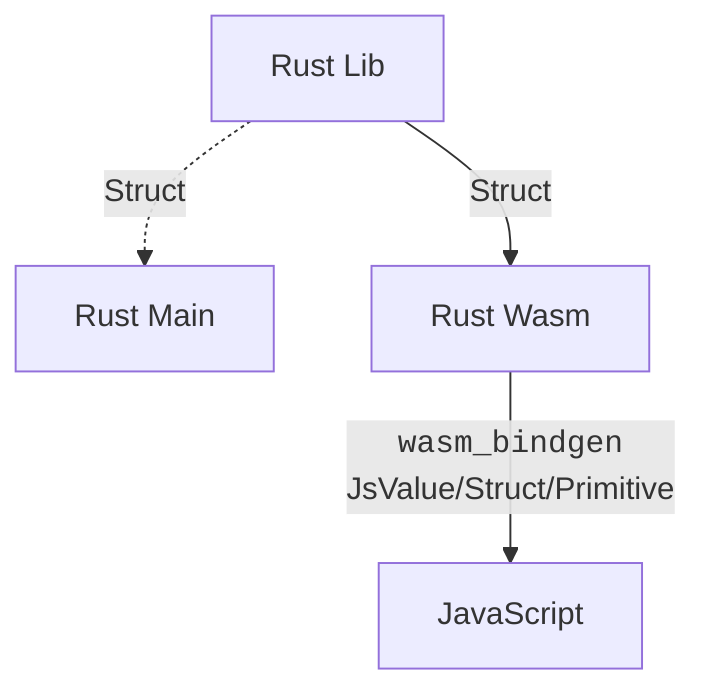

# Enjoy

 They said `Wasm` should be fun, Let's do it!

> 💡 for more examples see 👉 [here](https://github.com/rustwasm/wasm-bindgen/tree/main/examples)

## JS Object in Wasm

```rust,no_run
// 👇 This allow us to bind rs with js
#[wasm_bindgen]
//      This & 👇 mean short-lived.
pub fn foo(bar: &JsValue) {
    // ...
}

#[wasm_bindgen]
// And this no & 👇 mean long-lived.
pub fn foo(bar: JsValue) {
    // ...
}
```

## Relation Overview



## Target

- `wasm32-unknown-unknown`: for standalone use in or outside the browser.
- `wasm32-wasi`: for use outside the browser. (e.g. [`Fastly`](https://developer.fastly.com/learning/compute/))
- `wasm32-unknown-emscripten`: mostly for browser (JavaScript) use.

// 🚧 UNDER CONSTRUCTION
// If you can't wait try start [here](https://book.gist.rs/bye.html#wasm-resources)
