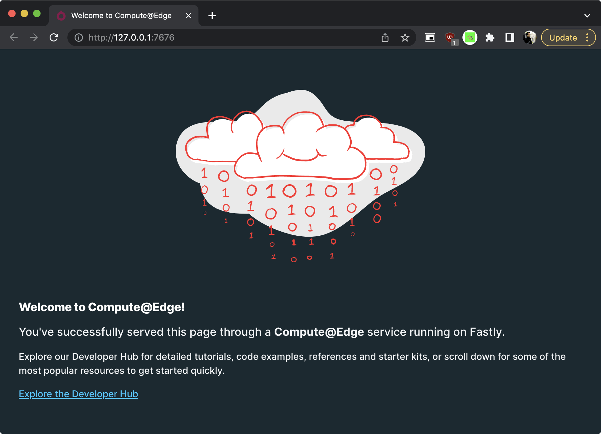
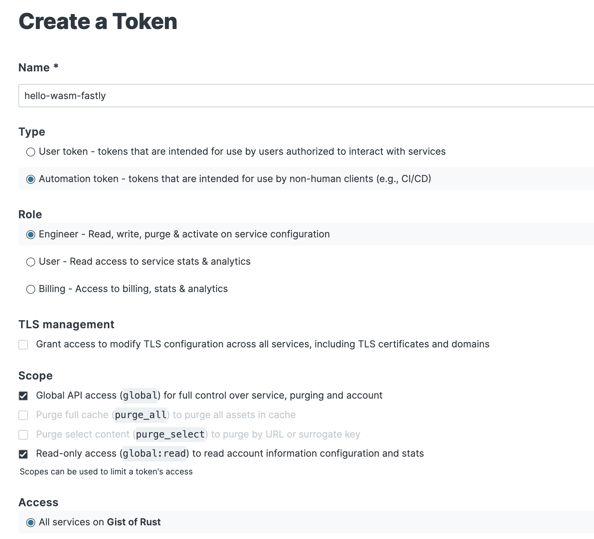
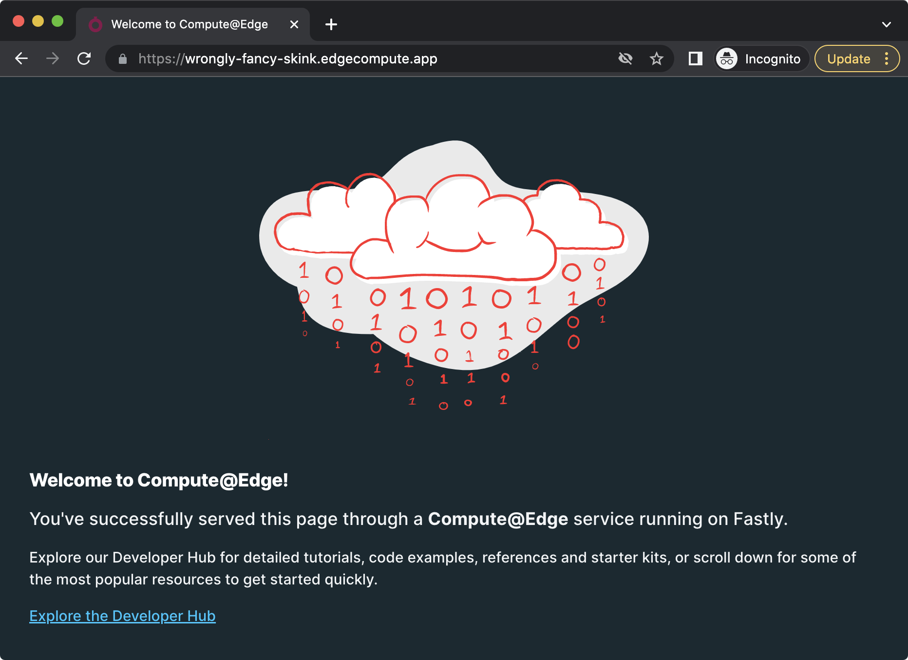

## Hello `Fastly`

## Setup CLI

```
# Install Homebrew
/bin/bash -c "$(curl -fsSL https://raw.githubusercontent.com/Homebrew/install/HEAD/install.sh)"

# Install Fastly
brew install fastly/tap/fastly
```

## Init

```
mkdir hello-wasm-fastly
cd hello-wasm-fastly
fastly compute init
```

## Serve locally

```
fastly compute serve
open http://127.0.0.1:7676/
```



## Prepare FASTLY_API_TOKEN

> Get `REPLACE_ME_WITH_YOUR_FASTLY_API_TOKEN` from [https://manage.fastly.com/account/personal/tokens]() with write permission.

```
Name: hello-wasm-fastly
Role: Engineer
Scope: Global API access (global), Read-only access (global:read)
```



## Deploy

```
fastly compute deploy --token REPLACE_ME_WITH_YOUR_FASTLY_API_TOKEN
```

### Output

```
fastly compute deploy --token REPLACE_ME_WITH_YOUR_FASTLY_API_TOKEN
There is no Fastly service associated with this package. To connect to an existing service
add the Service ID to the fastly.toml file, otherwise follow the prompts to create a
service now.

Press ^C at any time to quit.

Create new service: [y/N] y

Service name: [hello-wasm-fastly]

✓ Creating service

Domain: [wrongly-fancy-skink.edgecompute.app]

Backend (hostname or IP address, or leave blank to stop adding backends):

✓ Creating domain 'wrongly-fancy-skink.edgecompute.app'
✓ Uploading package
✓ Activating service (version 1)
✓ Checking service availability (status: 200)

Manage this service at:
        https://manage.fastly.com/configure/services/xQHbmi6S43MSFk9L5p9IW7

View this service at:
        https://wrongly-fancy-skink.edgecompute.app


SUCCESS: Deployed package (service xQHbmi6S43MSFk9L5p9IW7, version 1)
```



## Caveats

- crate must support `wasm-wasi`: see https://developer.fastly.com/learning/compute/rust/#using-dependencies

## To Improve

- [GitHub Actions for Compute@Edge](https://www.fastly.com/blog/introducing-github-actions-for-compute-edge-a-new-resource-to-help-ship-code)
